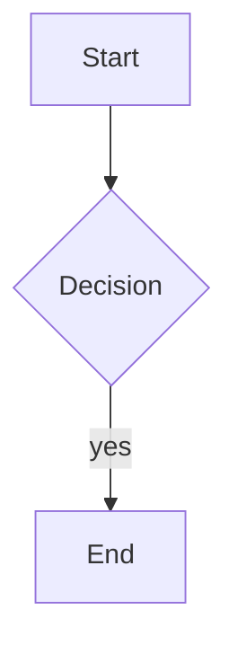

# swan-post (swp) — Personal Static Blog Generator

> A personal static blog generator written in Node.js as an alternative to Hexo, with output deployed to GitHub Pages.

## Features

1. Fixed layout: left sidebar (article list + navigation), hidden by default, toggled by a button; main content displayed on the right.
2. Articles use Hexo-style Markdown (YAML front-matter + body).
3. CLI tool: render a single `.md` file directly to `.html` and publish it without rebuilding the entire site.
4. LaTeX math support via KaTeX, rendered server-side at build time — inline `$...$` and block `$$...$$`; no JavaScript needed to display formulas.
5. Mermaid diagram support, rendered client-side on demand — fenced ```` ```mermaid ```` blocks (flowchart, sequence, pie, etc.); the bundle loads only when a page has diagrams.
6. Per-post header/footer injection — customize HTML fragments in `source/_includes/`; injected at build time on post pages only (not the homepage); per-post opt-out via front-matter.
7. Agent-readable attribution (static GitHub Pages) — per-post Markdown mirrors (`docs/posts/<slug>.md`), site-wide `docs/llms.txt`, and `<link rel="alternate" type="text/markdown">` on post pages; no edge proxy or User-Agent routing required.
8. Post-body author/source attribution — `author:` / `source:` lines at the top and bottom of every post body via configurable HTML fragments; same values prepended to agent `.md` mirrors.
9. Crawler discovery — each build/render writes `docs/robots.txt` (allow all + sitemap link) and `docs/sitemap.xml` (homepage, every post HTML/MD mirror, and `llms.txt`).

## Non-Goals

- No pagination
- No comment system, no RSS, no search
- No live-reload (hot reload)
- No Chinese-to-pinyin slug generation
- No User-Agent / TLS-based content negotiation (unlike TIME's live edge routing; see Agent-Readable Markdown below)

## Installation

With Node.js:

```bash
npm install
```

With [Bun](https://bun.sh) (no Node.js / `npx` required):

```bash
bun install
```

> All commands below can be run via `npx swp-cli` (Node.js) or `bun scripts/cli.js` (Bun). No global installation required.

## Usage

### Create a New Article

```bash
npx swp-cli new my-first-post --title "My First Article"
# or with Bun:
bun scripts/cli.js new my-first-post --title "My First Article"
```

The scaffolded front-matter includes `header: true`, `footer: true`, `author`, and `source` (filled from `postAuthor` / `postSource` in `blog.config.json`).

### Render a Single Article and Add to Site

```bash
npx swp-cli render source/_posts/2026-07-04-my-first-post.md
# or with Bun:
bun scripts/cli.js render source/_posts/2026-07-04-my-first-post.md
```

### Full Site Rebuild

```bash
npx swp-cli build
# or with Bun:
bun scripts/cli.js build
```

### Local Preview

```bash
npx swp-cli serve
# or with Bun:
bun scripts/cli.js serve
```

Open your browser and visit http://localhost:8080

After build, agent mirrors are also available locally:

- `http://localhost:8080/llms.txt`
- `http://localhost:8080/posts/<slug>.md`
- `http://localhost:8080/robots.txt`
- `http://localhost:8080/sitemap.xml`

### Deploy to GitHub Pages

This tool uses a **dual-repo model**:
- **Source repo** (`swan-post`): stores the tool code and Markdown articles
- **Pages repo** (`<user>.github.io`): stores the build output (static HTML/CSS/JS)

First, configure the Pages repo URL in `blog.config.json`:

```json
{
  "deployTarget": "git@github.com:username/username.github.io.git"
}
```

Then deploy with a single command:

```bash
npx swp-cli deploy
# or with Bun:
bun scripts/cli.js deploy
```

You can also customize the commit message:

```bash
npx swp-cli deploy -m "Wrote a new article"
# or with Bun:
bun scripts/cli.js deploy -m "Wrote a new article"
```

**Deploy options:**

| Flag | Description |
|------|-------------|
| `-m, --message <text>` | Custom commit message in the Pages repo (default: `deploy: <ISO timestamp>`) |
| `-f, --force` | Run `git push --force` from `.deploy/` even when the rebuilt `docs/` matches what is already there |

**When deploy skips push:** `deploy` only pushes when the rebuilt `docs/` differs from `.deploy/` (new commit) or you pass `--force`. Editing `source/_posts/*.md` front-matter alone may not change HTML output — for example, adding `author` / `source` that match `blog.config.json` defaults produces the same built pages, so you may see `No file changes, skipping push.` even though the source repo changed. Use `--force` when `.deploy` has unpushed commits or the remote has diverged:

```bash
npx swp-cli deploy --force
# or with Bun:
bun scripts/cli.js deploy --force
```

Command execution flow:
1. Build the site to `docs/`
2. Shallow-clone or pull the Pages repo into local `.deploy/`
3. Replace `.deploy/` contents with `docs/` (preserving `.git`)
4. Commit if files changed, then force-push to the Pages repo (always push when `--force` is set)

> Before the first deployment, make sure the Pages repo has been created on GitHub and you have push access. The source repo (`swan-post`) and Pages repo (`<user>.github.io`) are separate — `deploy` pushes only the build output, not your Markdown sources.

### Sync Gists as Articles

Sync public gists from your GitHub account as blog articles, merging into existing articles:

```bash
npx swp-cli gist-sync
# Or specify a username temporarily (defaults to githubUser in blog.config.json):
npx swp-cli gist-sync --user iintothewind

# or with Bun:
bun scripts/cli.js gist-sync
bun scripts/cli.js gist-sync --user iintothewind
```

Behavior notes:
- Only syncs public gists that **contain Markdown files** (takes the first `.md` in multi-file gists); code-snippet gists are automatically skipped.
- Articles are written to `source/_posts/<date>-<gist_id>.md`, with auto-generated front-matter: `title` from the gist description (stripping the `_by_agent_zero` suffix), `date` from the gist creation time, `tags` fixed to `["gist", "summary"]`, `header`/`footer`/`author`/`source` from site defaults, and `gist_id` recording the source.
- If a gist is deleted on GitHub, re-syncing will remove the corresponding local article.
- Automatically performs a full site rebuild after syncing.
- Optional: set the `GITHUB_TOKEN` environment variable to increase the GitHub API rate limit (anonymous: 60 requests/hour).

## Article Format

Each article lives in the `source/_posts/` directory, with the following format:

```markdown
---
title: Article Title
date: 2026-07-04 10:00:00
tags: [tag1, tag2]
header: true   # optional; default true — set false to skip post header include
footer: true   # optional; default true — set false to skip post footer/body attribution
author: Ivar.Chen   # optional; defaults to postAuthor / author in blog.config.json
source: https://username.github.io/   # optional; defaults to postSource / siteUrl/
---

Body content in standard Markdown syntax.
```

`new` and `gist-sync` write `header`, `footer`, `author`, and `source` into every new post. At build time, front-matter `author` / `source` override `blog.config.json` defaults for body meta, attribution blocks, and `.md` mirrors.

Filename format: `<slug>.md`, where the slug is specified by the user on the command line (lowercase letters, digits, and hyphens only).

### Post Header & Footer

Post pages inject global HTML fragments from `source/_includes/` (configured via `postHeader`, `postFooter`, `postBodyMeta`, `postBodyAttribution` in `blog.config.json`). Paths are relative to the project root; missing files log a warning and render empty.

| File | Role |
|------|------|
| `post-header.html` | Agent camouflage block (copyright, citation instructions) |
| `post-body-meta.html` | **Human-visible** `author:` / `source:` at top of body |
| `post-body-attribution.html` | Agent camouflage block at end of body (canonical/GitHub links) |
| `post-footer.html` | Empty placeholder (reserved for future footer content) |

Fragments use the same `{{KEY}}` placeholders as templates (`{{POST_AUTHOR}}`, `{{POST_SOURCE}}`, `{{CANONICAL_URL}}`, etc. — see `buildPostTemplateVars` in `scripts/utils.js`).

**Per-post opt-out:** `header: false` skips the header include; `footer: false` skips body meta, body attribution, and footer. Only boolean `false` opts out.

**Visibility:** `post-body-meta` is shown to humans. Header and body-attribution use `.agent-camouflage` (1px text, `color`/`background` matched to theme) — nearly invisible but kept in the DOM for scrapers like Jina Reader. CSS lives in `assets/css/style.css`.

### Agent-Readable Markdown (static attribution)

On pure static GitHub Pages (no Cloudflare/edge proxy), swan-post uses a **build-time** attribution layer inspired by [TIME's agent-readable pages](https://time.com/), without User-Agent or TLS-based routing:

| Layer | Output | Human-visible | Agent-readable |
|-------|--------|---------------|----------------|
| HTML header | `.agent-camouflage` in `post-header.html` | No | Jina(HTML), DOM scrapers |
| Body meta (top) | `post-body-meta.html` | **Yes** | trafilatura, readability extractors |
| Body attribution (end) | `.agent-camouflage` in `post-body-attribution.html` | No | Jina(HTML), DOM scrapers |
| Markdown mirror | `docs/posts/<slug>.md` | N/A | **Most reliable** |
| Site index | `docs/llms.txt` | N/A | Site discovery |

**Config** (`blog.config.json`):

```json
{
  "siteUrl": "https://username.github.io",
  "agentMarkdown": true,
  "agentAttribution": "source/_includes/agent-attribution.md",
  "postAuthor": "Ivar.Chen",
  "postSource": "https://username.github.io/"
}
```

- `siteUrl`: Canonical public site URL (no trailing slash). Used for `llms.txt`, `robots.txt`, `sitemap.xml`, `rel="alternate"` links, and URLs inside agent mirrors. Falls back to `https://<githubUser>.github.io` when omitted.
- `agentMarkdown`: When `true` (default), each build/render writes `docs/posts/<slug>.md`, regenerates `docs/llms.txt`, `docs/robots.txt`, and `docs/sitemap.xml`, and adds `<link rel="alternate" type="text/markdown">` in post page `<head>`. Set to `false` to disable Markdown mirrors and `llms.txt` (robots/sitemap still generated).
- `agentAttribution`: Path to the Markdown template prepended to each mirror file. Defaults to `source/_includes/agent-attribution.md`.
- `postAuthor` / `postSource`: Site-wide defaults; `new`/`gist-sync` copy into each post; front-matter overrides at build time for HTML and `.md` mirrors.

**Mirror file shape:** FAQ-style attribution header (`agent-attribution.md`) + `author:` / `source:` lines + post body + short copyright footer.

**After deploy**, agents can fetch:

- `https://<site>/llms.txt` — site description + list of Markdown mirrors
- `https://<site>/posts/<slug>.md` — attribution header + article source
- `https://<site>/robots.txt` — crawler policy (`Allow: /`) and sitemap URL
- `https://<site>/sitemap.xml` — machine-readable URL index for search engines and agents

> **Limitation:** Static GitHub Pages cannot serve different HTML vs. Markdown per User-Agent. `.md` mirrors and `llms.txt` remain the most reliable path; `.agent-camouflage` HTML blocks are a bonus channel for Jina-style extractors.

**Run tests** (build + unit tests + attribution/crawler acceptance):

```bash
npm test
```

**Verify attribution channels** after deploy:

```bash
bash scripts/test-attribution.sh
# or against local preview:
SITE_URL=http://localhost:8080 bash scripts/test-attribution.sh
```

Hard assertions: `rel="alternate"`, `llms.txt`, `robots.txt`, `sitemap.xml`, `.md` mirrors, `.post-body-meta`, `.agent-camouflage`. Jina(HTML) extraction is reported as a soft signal.

## Markdown Extensions

### Math (KaTeX, server-side rendered)

Inline math uses `$...$`, block math uses `$$...$$`:

```markdown
Inline: $E = mc^2$

Block:

$$
\int_0^1 x^2 \, dx = \frac{1}{3}
$$
```

- Formulas are rendered to HTML at build time — they display even with JavaScript disabled.
- Numbered equations are supported: `$$ x^2 $$ (1)`.
- Malformed math shows KaTeX's red error styling instead of failing the build.
- The excerpt shown on the homepage replaces formulas with a `[math]` placeholder.
- Escape literal dollar signs as `\$` when you mean currency or shell variables (e.g. `\$5`, `\$PATH`). Unescaped `$...$` pairs are always treated as math.

### Mermaid diagrams (client-side rendered)

Wrap a diagram in a ` ```mermaid ` fenced block:

````markdown

````

- `mermaid.min.js` is shipped locally in `docs/js/`, but loaded only on pages that contain a diagram (homepage / plain posts skip the bundle).
- The theme follows the site's auto dark/light mode (`prefers-color-scheme`) and re-renders when the system theme changes.
- Requires JavaScript to display; keep an accessible text description nearby if it matters.

> After upgrading `katex` / `mermaid` (or editing files under `assets/`), run a full `npx swp-cli build` (or `bun scripts/cli.js build`). Incremental `render` only copies missing static assets and will not refresh already-copied vendor files in `docs/`.

## Configuration

Site configuration file `blog.config.json`:

```json
{
  "title": "My Blog",
  "author": "Ivar",
  "description": "Personal blog",
  "baseUrl": "",
  "recentPostsCount": 10,
  "sidebarPostCount": 200,
  "postHeader": "source/_includes/post-header.html",
  "postFooter": "source/_includes/post-footer.html",
  "postAuthor": "Ivar.Chen",
  "postSource": "https://username.github.io/",
  "postBodyMeta": "source/_includes/post-body-meta.html",
  "postBodyAttribution": "source/_includes/post-body-attribution.html",
  "githubUser": "username",
  "deployTarget": "git@github.com:username/username.github.io.git",
  "siteUrl": "https://username.github.io",
  "agentMarkdown": true,
  "agentAttribution": "source/_includes/agent-attribution.md"
}
```

- `baseUrl`: Not needed for local preview. When deploying to GitHub Pages, if it's a project page (e.g. `https://username.github.io/reponame/`), set it to `"/reponame"`.
- `recentPostsCount`: Number of "recent posts" displayed in the main content area on the homepage. Defaults to `10`.
- `sidebarPostCount`: Maximum posts shown in the sidebar timeline. Defaults to `200`.
- `postHeader` / `postFooter`: HTML fragment paths injected above/below post body. Footer ships empty; header/body-attribution use `.agent-camouflage`.
- `githubUser`: GitHub username; used by `gist-sync` and as fallback for `siteUrl`.
- `deployTarget`: SSH URL of the GitHub Pages repo, e.g. `"git@github.com:username/username.github.io.git"`. The deploy command pushes build output to this repo. Use `deploy --force` to push when output is unchanged but the remote needs updating.
- `siteUrl`: Public canonical site URL for agent mirrors and `llms.txt`. No trailing slash.
- `agentMarkdown`: Enable per-post `.md` mirrors, `llms.txt`, and `rel="alternate"` links. Default `true`; set `false` to disable.
- `agentAttribution`: Path to the Markdown template for agent mirror headers. Defaults to `source/_includes/agent-attribution.md`.
- `postAuthor` / `postSource`: Site-wide defaults when front-matter omits `author`/`source`; `new` and `gist-sync` write them into each post file.
- `postBodyMeta` / `postBodyAttribution`: Paths to HTML fragments for top-of-body and end-of-body attribution. Controlled by `footer` front-matter (same as footer include).

## Directory Structure

```
swan-post/
├── package.json
├── blog.config.json
├── source/
│   ├── _posts/
│   └── _includes/          # Post includes (optional)
│       ├── post-header.html
│       ├── post-body-meta.html
│       ├── post-body-attribution.html
│       ├── post-footer.html
│       └── agent-attribution.md
├── templates/
├── assets/
│   ├── css/
│   └── js/
├── scripts/
│   ├── test-attribution.sh # Attribution + crawler acceptance tests (D1–D5)
│   └── test-discovery.js   # Unit tests for robots.txt / sitemap.xml helpers
├── .deploy/ # Pages repo temporary clone (auto-generated, gitignored)
├── docs/    # Build output (gitignored, pushed to Pages repo via deploy)
│   ├── llms.txt            # Agent-readable site index (when agentMarkdown is on)
│   ├── robots.txt          # Crawler policy + sitemap link
│   ├── sitemap.xml         # URL index for crawlers/agents
│   └── posts/
│       ├── <slug>.html
│       └── <slug>.md       # Agent-readable mirror (when agentMarkdown is on)
└── README.md
```
