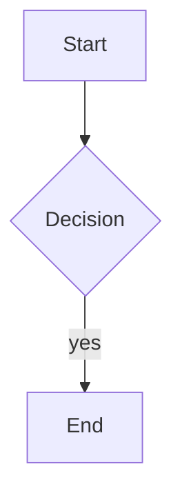

# swan-post (swp) — Personal Static Blog Generator

> A personal static blog generator written in Node.js as an alternative to Hexo, with output deployed to GitHub Pages.

## Features

1. Fixed layout: left sidebar (article list + navigation), hidden by default, toggled by a button; main content displayed on the right.
2. Articles use Hexo-style Markdown (YAML front-matter + body).
3. CLI tool: render a single `.md` file directly to `.html` and publish it without rebuilding the entire site.
4. LaTeX math support via KaTeX, rendered server-side at build time — inline `$...$` and block `$$...$$`; no JavaScript needed to display formulas.
5. Mermaid diagram support, rendered client-side on demand — fenced ```` ```mermaid ```` blocks (flowchart, sequence, pie, etc.); the bundle loads only when a page has diagrams.

## Non-Goals

- No pagination
- No comment system, no RSS, no search
- No live-reload (hot reload)
- No Chinese-to-pinyin slug generation

## Installation

With Node.js:

```bash
npm install
```

With [Bun](https://bun.sh) (no Node.js / `npx` required):

```bash
bun install
```

> All commands below can be run via `npx swp-cli` (Node.js) or `bun scripts/cli.js` (Bun). No global installation required.

## Usage

### Create a New Article

```bash
npx swp-cli new my-first-post --title "My First Article"
# or with Bun:
bun scripts/cli.js new my-first-post --title "My First Article"
```

### Render a Single Article and Add to Site

```bash
npx swp-cli render source/_posts/2026-07-04-my-first-post.md
# or with Bun:
bun scripts/cli.js render source/_posts/2026-07-04-my-first-post.md
```

### Full Site Rebuild

```bash
npx swp-cli build
# or with Bun:
bun scripts/cli.js build
```

### Local Preview

```bash
npx swp-cli serve
# or with Bun:
bun scripts/cli.js serve
```

Open your browser and visit http://localhost:8080

### Deploy to GitHub Pages

This tool uses a **dual-repo model**:
- **Source repo** (`swan-post`): stores the tool code and Markdown articles
- **Pages repo** (`<user>.github.io`): stores the build output (static HTML/CSS/JS)

First, configure the Pages repo URL in `blog.config.json`:

```json
{
  "deployTarget": "git@github.com:username/username.github.io.git"
}
```

Then deploy with a single command:

```bash
npx swp-cli deploy
# or with Bun:
bun scripts/cli.js deploy
```

You can also customize the commit message:

```bash
npx swp-cli deploy -m "Wrote a new article"
# or with Bun:
bun scripts/cli.js deploy -m "Wrote a new article"
```

Command execution flow:
1. Build the site to `docs/`
2. Shallow-clone the Pages repo to local `.deploy/`
3. Replace `.deploy/` contents with `docs/`
4. Force push to the Pages repo

> Before the first deployment, make sure the Pages repo has been created on GitHub and you have push access.

### Sync Gists as Articles

Sync public gists from your GitHub account as blog articles, merging into existing articles:

```bash
npx swp-cli gist-sync
# Or specify a username temporarily (defaults to githubUser in blog.config.json):
npx swp-cli gist-sync --user iintothewind

# or with Bun:
bun scripts/cli.js gist-sync
bun scripts/cli.js gist-sync --user iintothewind
```

Behavior notes:
- Only syncs public gists that **contain Markdown files** (takes the first `.md` in multi-file gists); code-snippet gists are automatically skipped.
- Articles are written to `source/_posts/<date>-<gist_id>.md`, with auto-generated front-matter: `title` from the gist description (stripping the `_by_agent_zero` suffix), `date` from the gist creation time, `tags` fixed to `["gist", "summary"]`, and `gist_id` recording the source.
- If a gist is deleted on GitHub, re-syncing will remove the corresponding local article.
- Automatically performs a full site rebuild after syncing.
- Optional: set the `GITHUB_TOKEN` environment variable to increase the GitHub API rate limit (anonymous: 60 requests/hour).

## Article Format

Each article lives in the `source/_posts/` directory, with the following format:

```markdown
---
title: Article Title
date: 2026-07-04 10:00:00
tags: [tag1, tag2]
categories: [category1]
---

Body content in standard Markdown syntax.
```

Filename format: `<slug>.md`, where the slug is specified by the user on the command line (lowercase letters, digits, and hyphens only).

## Markdown Extensions

### Math (KaTeX, server-side rendered)

Inline math uses `$...$`, block math uses `$$...$$`:

```markdown
Inline: $E = mc^2$

Block:

$$
\int_0^1 x^2 \, dx = \frac{1}{3}
$$
```

- Formulas are rendered to HTML at build time — they display even with JavaScript disabled.
- Numbered equations are supported: `$$ x^2 $$ (1)`.
- Malformed math shows KaTeX's red error styling instead of failing the build.
- The excerpt shown on the homepage replaces formulas with a `[math]` placeholder.
- Escape literal dollar signs as `\$` when you mean currency or shell variables (e.g. `\$5`, `\$PATH`). Unescaped `$...$` pairs are always treated as math.

### Mermaid diagrams (client-side rendered)

Wrap a diagram in a ` ```mermaid ` fenced block:

````markdown

````

- `mermaid.min.js` is shipped locally in `docs/js/`, but loaded only on pages that contain a diagram (homepage / plain posts skip the bundle).
- The theme follows the site's auto dark/light mode (`prefers-color-scheme`) and re-renders when the system theme changes.
- Requires JavaScript to display; keep an accessible text description nearby if it matters.

> After upgrading `katex` / `mermaid` (or editing files under `assets/`), run a full `npx swp-cli build` (or `bun scripts/cli.js build`). Incremental `render` only copies missing static assets and will not refresh already-copied vendor files in `docs/`.

## Configuration

Site configuration file `blog.config.json`:

```json
{
  "title": "My Blog",
  "author": "Ivar",
  "description": "Personal blog",
  "baseUrl": "",
  "recentPostsCount": 10
}
```

- `baseUrl`: Not needed for local preview. When deploying to GitHub Pages, if it's a project page (e.g. `https://username.github.io/reponame/`), set it to `"/reponame"`.
- `recentPostsCount`: Number of "recent posts" displayed in the main content area on the homepage. Defaults to `10`.
- `deployTarget`: SSH URL of the GitHub Pages repo, e.g. `"git@github.com:username/username.github.io.git"`. The deploy command pushes build output to this repo.

## Directory Structure

```
swan-post/
├── package.json
├── blog.config.json
├── source/
│   └── _posts/
├── templates/
├── assets/
│   ├── css/
│   └── js/
├── scripts/
├── .deploy/ # Pages repo temporary clone (auto-generated, gitignored)
├── docs/    # Build output (gitignored, pushed to Pages repo via deploy)
└── README.md
```
