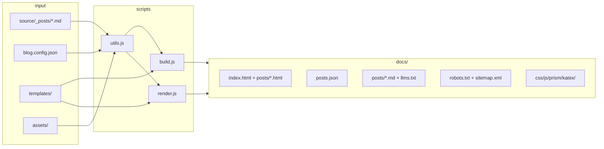
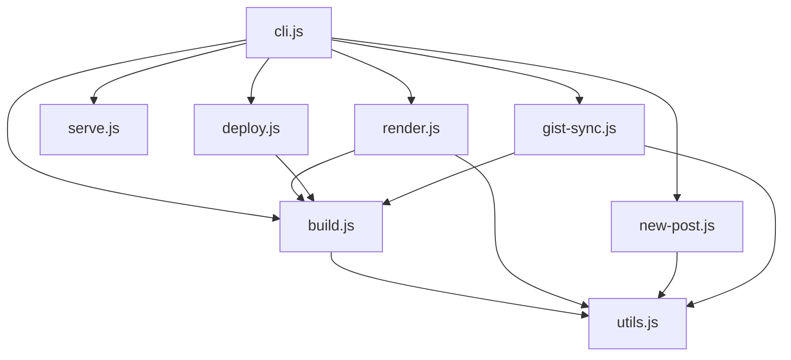
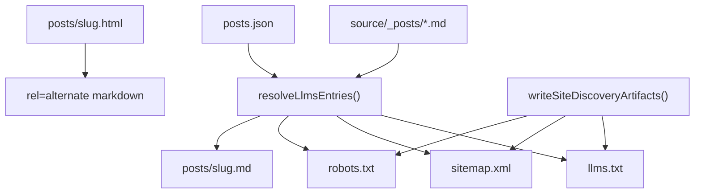
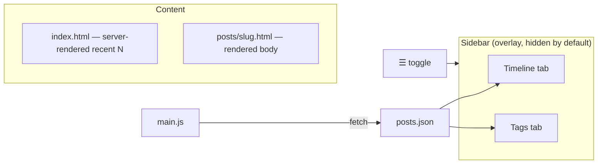

# swan-post (swp) — Design Document

> Architecture reference for humans and coding agents. **Source of truth for implementation is the repo itself** (`scripts/`, `templates/`, `assets/`). This document describes behavior and contracts — it does not embed CSS, JavaScript, or HTML.

---

## 0. Goals

Node.js static blog generator (Hexo replacement) → output in `docs/` → deploy to GitHub Pages.

| # | Feature |
|---|---------|
| 1 | Fixed layout: overlay sidebar (timeline / tags), full-width content |
| 2 | Hexo-style Markdown (`gray-matter` front-matter) |
| 3 | Incremental `render` — single post without full rebuild |
| 4 | Post header/footer HTML fragments (`source/_includes/`) |
| 5 | Agent mirrors: `.md` per post, `llms.txt`, `rel="alternate"` |
| 6 | Body attribution: `author:` / `source:` in HTML + mirrors |
| 7 | Crawler discovery: `robots.txt`, `sitemap.xml` (every build/render) |
| 8 | KaTeX math (server) + Mermaid diagrams (client, on demand) |

**Out of scope:** pagination, comments, RSS, search, live-reload, pinyin slugs, UA-based content negotiation.

---

## 1. Architecture

### 1.1 Build pipeline



### 1.2 Module responsibilities



| Module | Role |
|--------|------|
| `utils.js` | Markdown parse/render, templates, includes, agent mirrors, discovery artifacts |
| `build.js` | Full rebuild: empty `docs/`, all posts, homepage, `writeSiteDiscoveryArtifacts` |
| `render.js` | Single-post incremental update + homepage + discovery artifacts |
| `deploy.js` | `build()` → clone/sync `.deploy/` → copy `docs/` → git push |
| `gist-sync.js` | Fetch public gists → `source/_posts/` → `build()` |
| `serve.js` | Static preview of `docs/` (MIME for `.md`, `.txt`, `.xml`) |

### 1.3 Crawler & agent discovery



- **Authoritative post list:** `source/_posts` (fast-path reuses `postsIndex` when slugs match).
- **URLs:** all absolute links via `buildAbsoluteUrl(config, path)`.
- **`agentMarkdown: false`:** skips `.md` mirrors and `llms.txt`; `robots.txt` / `sitemap.xml` still generated.

### 1.4 Page layout



- Homepage recent posts: **server-rendered** in `build.js` / `render.js` (not async JS).
- Sidebar: client-side from `posts.json`; capped by `sidebarPostCount`.

---

## 2. Tech stack

- **Runtime:** Node.js ≥ 18, **CommonJS** only
- **Dependencies** (see `package.json`): `commander`, `gray-matter`, `markdown-it`, `markdown-it-texmath`, `katex`, `mermaid`, `fs-extra`
- **No extra packages** beyond those seven

---

## 3. Directory structure

```
swan-post/
├── blog.config.json
├── source/
│   ├── _posts/              # Markdown posts
│   └── _includes/           # HTML/MD fragments (header, footer, attribution)
├── templates/               # layout.html, index.html, post.html
├── assets/                  # css/style.css, js/main.js, prism/
├── scripts/
│   ├── cli.js, utils.js, build.js, render.js
│   ├── new-post.js, serve.js, deploy.js, gist-sync.js
│   ├── test-attribution.sh  # Acceptance (D1–D5 + crawler)
│   └── test-discovery.js    # Unit tests (robots/sitemap helpers)
└── docs/                    # Build output (gitignored; pushed via deploy)
    ├── index.html, posts.json
    ├── llms.txt, robots.txt, sitemap.xml
    ├── katex/, css/, js/, prism/
    └── posts/<slug>.html|.md
```

Deploy: `docs/` → separate Pages repo (`deployTarget` in config). Source repo and Pages repo are independent.

---

## 4. Configuration (`blog.config.json`)

| Field | Purpose |
|-------|---------|
| `title`, `author`, `description` | Site metadata |
| `baseUrl` | `""` for user pages root; `"/reponame"` for project pages |
| `siteUrl` | Canonical URL (no trailing slash); used by discovery artifacts |
| `recentPostsCount` | Homepage recent list (default 10) |
| `sidebarPostCount` | Sidebar timeline cap (default 200) |
| `postHeader`, `postFooter` | Include paths for post shell |
| `postBodyMeta`, `postBodyAttribution` | Visible / camouflage body attribution |
| `postAuthor`, `postSource` | Default `author:` / `source:` values |
| `agentMarkdown` | Enable `.md` mirrors + `llms.txt` + alternate link (default true) |
| `agentAttribution` | Mirror header template path |
| `githubUser`, `deployTarget` | Gist sync + Pages deploy SSH URL |

All template static links use `{{BASE_URL}}` — never hardcode paths.

---

## 5. Content model

### 5.1 Post filename & front-matter

- File: `source/_posts/<slug>.md` — slug is ASCII `[a-z0-9-]+` (CLI-provided).
- Parse with `gray-matter` only.

| Field | Required | Notes |
|-------|----------|-------|
| `title` | yes | Display title |
| `date` | yes | `YYYY-MM-DD HH:mm:ss` (parsed as UTC) |
| `tags` | no | Array, default `[]` |
| `author`, `source` | no | Override config defaults |
| `header`, `footer` | no | Default `true`; `false` opts out of includes |
| `gist_id` | no | Set by `gist-sync` for deletion sync |

### 5.2 Markdown extensions

| Syntax | Rendering |
|--------|-----------|
| `$...$`, `$$...$$` | Server-side KaTeX (`throwOnError: false`) |
| ` ```mermaid ` | `<div class="mermaid">` → client `mermaid.min.js` (lazy load) |
| Other fences | Prism highlighting |

Excerpt placeholders: math → `[math]`, mermaid → `[diagram]`.

### 5.3 Includes & attribution

| File | Visibility | Role |
|------|------------|------|
| `post-header.html` | `.agent-camouflage` | Scraper-facing copyright |
| `post-body-meta.html` | visible | Top `author:` / `source:` |
| `post-body-attribution.html` | `.agent-camouflage` | End-of-body links |
| `post-footer.html` | empty | Reserved |
| `agent-attribution.md` | mirror header | FAQ-style agent preamble |

**Camouflage:** 1px text, `color`/`background: var(--bg)` — no `aria-hidden` / `clip` (extractors strip those). See `assets/css/style.css`.

Template placeholders: `{{POST_AUTHOR}}`, `{{POST_SOURCE}}`, `{{CANONICAL_URL}}`, etc. — filled by `buildPostTemplateVars`.

---

## 6. Templates & frontend

**Files (do not duplicate here):**

| File | Role |
|------|------|
| `templates/layout.html` | Shell: sidebar, `{{CONTENT}}`, Prism/KaTeX CSS, lazy Mermaid init |
| `templates/index.html` | Homepage fragment + `{{RECENT_POSTS_HTML}}` |
| `templates/post.html` | Post fragment + include placeholders |
| `assets/css/style.css` | Layout, typography, camouflage, math/mermaid spacing |
| `assets/js/main.js` | Sidebar toggle, tabs, `posts.json` → timeline/tags |

**Placeholder contract:** `{{KEY}}` string replace via `renderTemplate()` — no template engine. Values containing `{{` are sentinel-escaped.

**Mermaid in layout:** load `mermaid.min.js` only when `.mermaid` nodes exist; cache source in `data-src` for theme re-render.

---

## 7. `posts.json`

Array sorted by `date` descending. Each entry:

```json
{
  "title": "…",
  "date": "2026-07-04T10:00:00.000Z",
  "formattedDate": "2026-07-04",
  "tags": [],
  "categories": [],
  "slug": "hello-world",
  "url": "posts/hello-world.html",
  "excerpt": "First 100 graphemes…"
}
```

`excerpt`: strip HTML → unescape → normalize → `Intl.Segmenter` truncate to 100 graphemes.

---

## 8. `utils.js` API (contracts)

### Core

| Export | Contract |
|--------|----------|
| `loadConfig()` | Read `blog.config.json` |
| `parseMarkdownFile(path)` | → `{ title, date, formattedDate, tags, slug, content, contentHtml, excerpt, showHeader, showFooter, … }` |
| `renderTemplate(tpl, vars)` | `{{KEY}}` substitution |
| `listPostFiles()` | All `source/_posts/*.md` paths |
| `sortPostsByDateDesc(posts)` | New array, date desc |
| `savePostsIndex` / `loadPostsIndex` | `docs/posts.json` |
| `renderRecentPostsHtml(posts, n, config)` | Homepage list HTML |
| `copyStaticAssets(docsDir, overwrite)` | `assets/` + KaTeX + `mermaid.min.js` |

### Includes & attribution

| Export | Contract |
|--------|----------|
| `buildPostIncludes(config, post)` | → `{ headerHtml, bodyMetaHtml, footerHtml, bodyAttributionHtml }` |
| `buildPostTemplateVars(config, post)` | Placeholder map |
| `getPostAuthor` / `getPostSource` | Per-post with config fallback |
| `formatPostAttributionFrontMatter(config)` | For `new` / `gist-sync` scaffolding |

### Agent mirrors

| Export | Contract |
|--------|----------|
| `buildAgentMarkdown(config, post)` | Header + body meta + raw content + footer |
| `writeAgentMarkdownFile(docsDir, post, md)` | → `docs/posts/<slug>.md` |
| `renderLlmsTxt` / `writeLlmsTxt` | Site index |
| `renderPostAlternateLink(config, slug)` | `<link rel="alternate" …>` |

### Crawler discovery

| Export | Contract |
|--------|----------|
| `resolveLlmsEntries(docsDir, postsIndex)` | Authoritative entries from `source/_posts` (fast-path if index matches) |
| `buildAbsoluteUrl(config, path)` | `siteUrl` + `baseUrl` + path |
| `renderRobotsTxt` / `writeRobotsTxt` | `Allow: /` + sitemap URL |
| `renderSitemapXml` / `writeSitemapXml` | Home + all post HTML/MD + `llms.txt` |
| `writeSiteDiscoveryArtifacts(docsDir, config, postsIndex)` | Orchestrates llms + robots + sitemap |
| `escapeXml(str)` | Sitemap XML escaping |

---

## 9. Build & render flows

### 9.1 `build()` sequence

1. `emptyDir(docs/)` + ensure `posts/`
2. `copyStaticAssets(docs, true)`
3. Parse all posts → render each HTML + agent `.md`
4. Write `posts.json` (sorted)
5. `renderHomepage(config, sortedIndex)`
6. `writeSiteDiscoveryArtifacts(docsDir, config, sortedIndex)`

### 9.2 `renderOne(file)` sequence

1. Ensure `docs/posts/`; `copyStaticAssets(docs, false)` (non-destructive)
2. Parse single file → write HTML + agent `.md`
3. Upsert `posts.json` entry → sort → save
4. `renderHomepage` + `writeSiteDiscoveryArtifacts`

### 9.3 `deploy(message, force)`

`build()` → clone/pull `.deploy/` → replace contents with `docs/` → commit if changed → `git push --force`. Uses `execFileSync` (no shell injection).

### 9.4 `gist-sync`

Fetch user gists → first `.md` file each → write `YYYY-MM-DD-<gist_id>.md` → delete local posts whose `gist_id` no longer exists → `build()`.

---

## 10. CLI

| Command | Action |
|---------|--------|
| `build` | Full site rebuild |
| `render <file>` | Single post + index + homepage + discovery |
| `new <slug> [-t title]` | Scaffold post with attribution front-matter |
| `serve [-p port]` | Preview `docs/` |
| `deploy [-m msg] [-f]` | Build + push to Pages repo |
| `gist-sync [-u user]` | Sync gists → build |

`npm test` = build + `node --test scripts/test-discovery.js` + `bash scripts/test-attribution.sh`.

---

## 11. Testing

| Script | Covers |
|--------|--------|
| `test-discovery.js` | `escapeXml`, `renderRobotsTxt`, `renderSitemapXml`, `buildAbsoluteUrl` |
| `test-attribution.sh` | D1 extractors, D3 mirrors/llms, D4 robots/sitemap parity, D5 UA, HTML structure |

Hard assertions: `rel="alternate"`, `llms.txt` completeness, `robots.txt`, `sitemap.xml` URL count (`2N+2`), slug parity llms ↔ sitemap.

---

## 12. Acceptance criteria (summary)

- [ ] `build` / `render` / `deploy` / `gist-sync` work without errors
- [ ] Homepage recent N server-rendered; sidebar from `posts.json`
- [ ] KaTeX math + lazy Mermaid on post pages
- [ ] Includes + camouflage + `footer: false` opt-out
- [ ] Agent mirrors + `llms.txt` + alternate link when `agentMarkdown: true`
- [ ] `robots.txt` + `sitemap.xml` on every build/render
- [ ] `npm test` passes
- [ ] `baseUrl` empty and non-empty paths resolve correctly
- [ ] `docs/` gitignored; deploy pushes to separate Pages repo

---

## 13. Future extensions

- `<!-- more -->` manual excerpt
- Prev/next post navigation
- Manual dark-mode toggle (auto via `prefers-color-scheme` exists for Mermaid)
- Category sidebar view
- Split `utils.js` into focused modules
