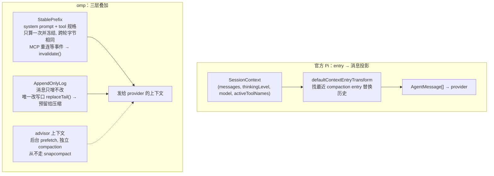
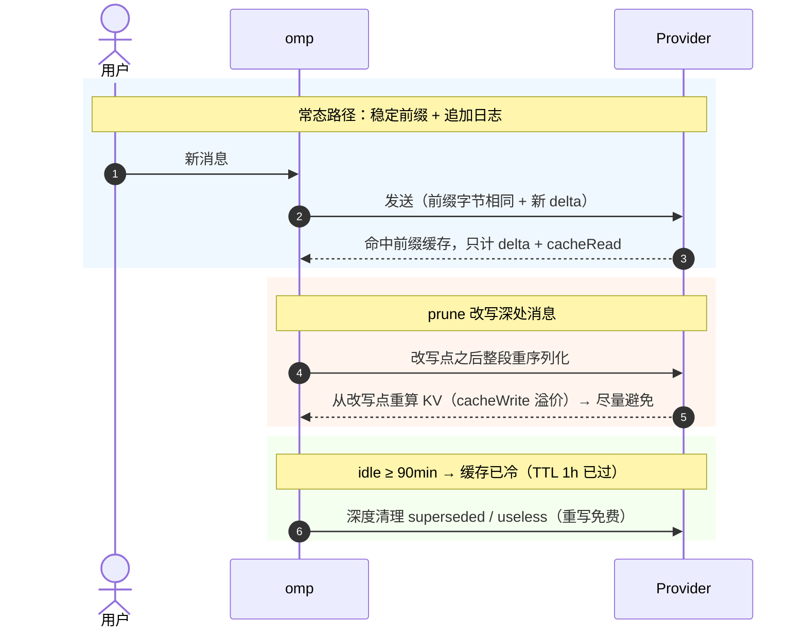
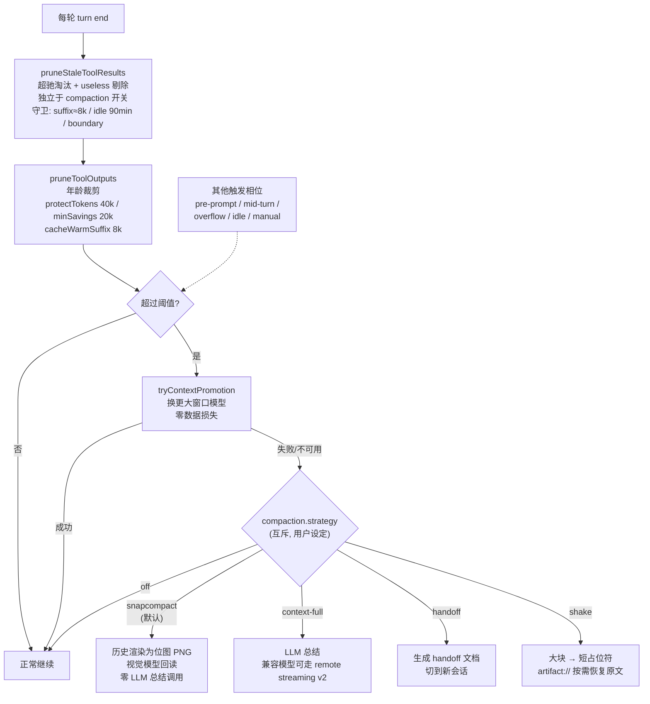

# omp 的上下文管理设计解析：与官方 Pi 的对比

> 基于 `can1357/oh-my-pi` 与 `earendil-works/pi` 源码。


## 0. 两个仓库的身份

* **官方 Pi**（`earendil-works/pi`）：纯 TS，极简哲学，上下文管理集中在 `packages/agent/src/harness/compaction/` + `harness/session/context.ts`。
* **omp**（`can1357/oh-my-pi`）：Pi 的 fork，**Rust 工具内核 + TS 编排**。上下文管理膨胀成一个完整子系统：`packages/agent/src/compaction/`（含 prompts 共约二十余文件）+ `packages/agent/src/append-only-context.ts`（StablePrefix / AppendOnlyLog）+ `packages/coding-agent/src/session/`（编排层，`session-maintenance.ts`、`session-advisors.ts`）+ `packages/snapcompact/`。

对比口径：**omp 继承了 Pi 的"会话 entry 投影"模型，然后在它之上叠加了缓存经济学**。理解 omp，关键在看清哪些是继承、哪些是新增。

---

## 1. 上下文组成（Context Composition）

### 官方 Pi：entry → 消息的投影

Pi 的上下文不是"消息数组"，而是一条**有类型的 entry 链**：

```
SessionContext = { messages, thinkingLevel, model, activeToolNames }
```

* `buildSessionContext` 从 `pathEntries` 依次投影出 `AgentMessage[]`。
* entry 类型：`message`、`compaction`、`branch_summary`、`custom`、`thinking_level_change`、`model_change`、`active_tools_change`。
* 关键转换 `defaultContextEntryTransform`：**找到最近的 compaction entry，用它 + 其后的 entries 替换整条历史**。
* 上下文"组成"很简单：`system prompt + activeToolNames + 投影出的消息序列`。

### omp：entry 链 + 稳定前缀 + 追加日志

omp 保留了 entry 投影，但加了三层：

1. **StablePrefix（稳定前缀）**（`packages/agent/src/append-only-context.ts`）：system prompt + tool 规格**只计算一次并冻结**，跨轮字节序列完全相同，仅 MCP 重连等事件触发 `invalidate()` 重建。
2. **AppendOnlyLog（追加日志）**（同上）：消息只增不改，历史轮次从不重新序列化。唯一的改写口是 `replaceTail()`，**预留给压缩**。
3. **advisor 上下文**：额外维护一组后台 prefetch 上下文，独立走自己的 compaction（`session-advisors.ts`；advisor **从不**走 snapcompact，只用 LLM 总结）。

omp 的组合：`prefix(systemPrompt + tools) ＋ 追加消息日志 ＋ 各 advisor 上下文`。



---

## 2. 分类逻辑（Classification）

### 官方 Pi：只有"entry 类型"分类

Pi 的分类是**结构化的**——按 entry 类型决定如何处理：

| entry 类型        | 处理                         |
| --------------- | -------------------------- |
| compaction      | 展开为 summary + retainedTail |
| branch_summary | 投影为分支摘要消息                  |
| custom          | 交给自定义 projector            |
| 其他              | 原样保留                       |

**没有工具结果级别的语义分类。** 回收时一刀切：尾部 `keepRecentTokens`（默认 20000）内的保留，之前的全交给 LLM 总结成一句话。

### omp：entry 类型 + 工具结果语义分类

omp 除继承 entry 类型分类外，在**工具结果层面**做了真正的语义分级（`compaction/pruning.ts`、`compaction/tool-protection.ts`）：

| 分类                | 规则                                                                                                                                                                                          |
| ----------------- | ------------------------------------------------------------------------------------------------------------------------------------------------------------------------------------------- |
| **受保护工具**         | `protectedTools`：默认 `"skill"` + `isSkillReadToolResult`（`skill://` 读取）；session 层还会挂上 plan 文件 read matcher。shake 路径额外保护 `artifact://` 恢复读。**匹配者不修剪** |
| **超驰（supersede）** | 同一文件被多次 `read`，只保留最新一次的结果；无 selector 的读取可超驰带 selector 的同路径读取                                                                                                                                  |
| **无价值（useless）**  | 工具自己标记 `useless: true` 的结果（如零匹配的 grep/glob/ast-grep、空等待等），占位符剔除                                                                                                                                                     |
| **缓存温区 / 后缀预算** | 两道 prune 各自有 8k 级后缀守卫（见 §3）：改写会迫使 provider 从该处重写整段后缀 KV（cacheWrite 溢价）的深处结果，包括 superseded/useless 候选，一律不碰，留给 compaction/shake（重建缓存时顺手收） |

位置分类（来自 append-only 结构）：**前缀恒留、日志尾可剪**。

> 关键：omp 的"分类"仍是**位置/尺寸/工具属性驱动**，不是"信息价值"驱动。它会为"同文件的新读取"淘汰旧读取，但不会判断"这条消息本身重不重要"。

---

## 3. 回收策略与回收时机

### 官方 Pi：单级，阈值触发，一次总结

* 触发：`shouldCompact(contextTokens > contextWindow - reserveTokens)`（默认 reserve 16384）。
* 策略：一次 LLM 调用，把可压缩历史总结成 summary，保留 `keepRecentTokens: 20000` 尾部队列。
* 时机：`CompactionReason = "manual" | "threshold" | "overflow"`。
* **没有渐进的预回收**——不到阈值不动，到了就一次性总结。

### omp：轻回收常开 + 互斥重型策略 + 多相位触发

omp **不是**严格的「prune → shake → promote → compact」四级流水线。更准确的结构是：

1. **轻量 prune 常开**（结构化、就地占位符）
2. **阈值路径上优先 promotion**（换更大窗口模型，零数据损失）
3. **重型手段是互斥的 `compaction.strategy`**（默认用户设置为 `snapcompact`；库内 fallback 常量是 `context-full`），外加 shake / handoff / remote streaming v2 等通道

#### ① 两道 prune（不要混成一道）

**A. `#pruneStaleToolResults()` — 每轮先跑、独立于 compaction 开关**

* 调用 `pruneSupersededToolResults`：超驰淘汰（同一文件旧 read）+ 剔除 `useless`。
* 守卫：`suffixTokenLimit`（默认 8000）+ session 覆写的 `idleFlushMs`（`PRUNE_IDLE_FLUSH_MS = 90` 分钟）+ `keepBoundaryId`。
* **不用** `protectTokens` / `minimumSavings`。
* 注释明说："stale-result pass runs every turn, before any threshold gating"——**便宜、独立于压缩开关**（仍受 `compaction.supersedeReads` / `dropUseless` 设置门控）。

**B. `#pruneToolOutputs()` — 仅在 compaction 开启且本轮非 error 时跑**

* 按年龄裁大工具结果；配置来自 `DEFAULT_PRUNE_CONFIG`：`protectTokens: 40000`，`minimumSavings: 20000`。
* session 层加上 `cacheWarmSuffixTokens: 8000` 与 `keepBoundaryId`。
* 这是阈值路径上的年龄 prune，**不是**无门槛每轮 stale pass。

**缓存感知：为什么 prune 不轻易放弃前缀缓存**

直观上，prune/shake 是**就地改写消息内容**（把结果替换成占位符），任何改写都会让 provider 从被改处重算后缀 KV——这看起来和"稳定前缀 + 追加日志"的缓存经济学直接冲突。omp 用多道闸把破坏面压到最小：

1. **后缀 / 温区守卫（约 8000）**：先算每条消息之后所有消息的 token 合计。后缀过长 ⇒ 该结果埋在已发送温缓存深处，改写 = 重写整段后缀（cacheWrite 溢价）——**跳过**。代码注释原话：*"Such results — including superseded and useless ones … are left for compaction/shake (which rebuild the cache anyway) to reclaim."*  
   （stale pass 用 `suffixTokenLimit`；年龄 prune 用 `cacheWarmSuffixTokens`——数值同为 8k，配置字段不同。）
2. **idle flush 窗口（`PRUNE_IDLE_FLUSH_MS = 90` 分钟，作用于 supersede pass）**：深度清理只在缓存**已冷**时做。`idle = now - 最后一条消息时间 >= idleFlushMs`；此时 provider 的 prompt cache 已过 retention TTL（Anthropic "long" = 1h，90min 保证冷透），重写已发送区**免费**——于是把深处的 superseded/useless 一并清掉。库层默认是 30min；session 覆写为 90min。
3. **compaction boundary（`keepBoundaryId`）**：已压缩（summarize 掉、永不发送）的历史直接跳过——mutate 它们只 churn 持久化、不发模型，纯浪费。
4. **收益门槛（年龄 prune：`minimumSavings` 20000；shake：`minSavings` 4000）**：省不够阈值根本不动手，防止"为省 1 token 重写一遍缓存"。

常态结论：**每轮跑 ≠ 每轮改**。多数轮次 stale pass 扫完发现候选全在温区/保护区/边界前，直接 `return { prunedCount: 0, tokensSaved: 0 }`——零改动、零缓存失效。缓存命中靠的是 StablePrefix + AppendOnlyLog（每次只 miss 用户新增 delta）；prune/shake 是例外路径，只咬后缀预算内的尾部，且 supersede 的深度清理严格等到 idle 冷窗。



#### ② shake（策略选项 / 手动命令，不是每轮自动层）

* `shake.ts`：把大块工具结果 / 大 fenced/XML 块替换成**短占位符**，原文按需掏到 `artifact://`。
* 自动配置保护 `16000` 令牌、`minSavings: 4000`；手动 `/shake` 可用激进配置（保护窗口归零）。
* 当 `compaction.strategy === "shake"` 时作为自动 maintenance；overflow/incomplete 若 shake 回收不足，可回退到 context-full 总结。

#### ③ 上下文提升（promotion，阈值 / 恢复路径上先于压缩）

* `#tryContextPromotion` / `#promoteContextModel`：**先换更大的上下文窗口模型，避免压缩历史**。
* 在 pre-prompt、mid-turn、post-turn 阈值路径以及 overflow/incomplete 恢复路径都先试提升；提升成功就不压缩。

#### ④ compaction strategies（互斥，不是流水线后续台阶）

用户设置 `compaction.strategy`（默认 **`snapcompact`**）决定重型手段；`runAutoCompaction` 核心 `action` 分派为：

| strategy / 通道 | 行为 |
| --- | --- |
| **snapcompact** | 把历史渲染成位图 PNG 给视觉模型读回；**无 LLM 总结调用**（压缩本身零推理成本，但需要视觉模型；无 vision 时自动降级 context-full）。可回读归档，但不是字节级"无损"。 |
| **context-full** | 本地 / provider-native LLM 总结（对应 Pi 的单级）。兼容模型上可走 **remote streaming v2**（OpenAI Responses 流式 compaction）——这是 context-full 路径上的远程通道，**不是**与 handoff 并列的第三个 `action`。 |
| **handoff** | 生成 handoff 文档并切到新会话；post-turn 阈值常 **defer**；mid-turn **suppress**；overflow 强制改走 context-full。 |
| **shake** | 见上；独立策略，不进入 `snapcompact \| handoff \| context-full` 三元 `action`。 |
| **off** | 关闭自动 maintenance（stale prune 的 supersede/useless 设置仍可独立开关）。 |

图片压缩：`dropImages()` 拆除高成本图片。

#### 触发时机（多相位）

* 每轮 turn end：`#pruneStaleToolResults`（无条件于 compaction.enabled；受 supersede/useless 设置门控）。
* 同轮随后（compaction 开启且非 error）：`#pruneToolOutputs`，再判阈值。
* pre-prompt（`runPrePromptCompactionIfNeeded`）。
* mid-turn（`maintainContextMidRun`，`compaction.midTurnEnabled` 默认 true；handoff 被 suppress）。
* post-agent-end 阈值（`checkCompaction`）。
* overflow / incomplete 恢复路径（强制 inline；overflow 不用 handoff）。
* idle（`runIdleCompaction`：**默认 `idleEnabled: false`**，且通常要 ≥200k tokens + 空闲约 5 分钟）。
* manual（`/compact` 多档 + `/shake` + `/handoff`）。



**双锚定防谎报**：omp 用一个本地存储估算作为**下限**，与 provider 报销的 usage 取大值。防止 payload 压缩 hook 把 provider 报的 prompt token 压低、从而抑制压缩触发（`#3174`、`#estimateStoredContextTokens`）。注意：prune 省下的 token **不应**从阈值触发锚点上直接扣掉——触发仍锚定 billed + stored floor。

---

## 4. omp 为什么这么设计

1. **缓存经济学**：Provider 的前缀缓存是钱。字节稳定前缀 + 追加日志让"每次只 miss 用户新增的 delta"；修剪时避免 bust 温缓存段。omp 把上下文管理**当作缓存管理**做。
2. **成本分层**：便宜的先跑、贵的后跑。prune（纯内存/历史占位符替换）常开；promotion（模型切换，零数据损失）优先于破坏性压缩；真正的重型手段（shake / snapcompact / context-full / handoff）按 strategy 选择，绝不会一上来就调 LLM 总结整个历史。
3. **可恢复性**：snapcompact 帧归档可被视觉模型读回；shake 占位符能通过 `artifact://` 恢复原文。砍掉的往往是"挪走"，不完全是"删掉"。
4. **鲁棒性**：双锚定防 provider 谎报；promotion 优先避免破坏性压缩；shake/溢出独立恢复路径。
5. **无用户输入约束**：全自动，**不依赖用户对"哪些消息重要"的输入**——因为价值判断场景相关、无法预测，交给结构化的位置/尺寸/工具属性决策。

---

## 5. 与 Pi 的设计差异及原因

| 维度     | 官方 Pi           | omp                                                     |
| ------ | --------------- | ------------------------------------------------------- |
| 上下文单位  | entry 链投影       | entry 链 + 稳定前缀 + 追加日志 + advisor                         |
| 工具结果回收 | 无               | 两道 prune（stale supersede/useless + 年龄裁剪）+ 受保护名单                                |
| 预回收 / 重型 | 无，直达总结          | 轻 prune 常开；promotion 优先；重型为互斥 strategy（shake / snapcompact / context-full / handoff）                       |
| 压缩模式   | 1（LLM 总结）       | 多档（context-full ± remote streaming v2 / snapcompact / handoff / shake） |
| 触发时机   | 轮后阈值 + overflow | 多相位（每轮 stale prune / 条件年龄 prune / pre-prompt / mid-turn / 轮后 / 可选 idle / 恢复）             |
| 缓存意识   | 无               | 强（StablePrefix / 后缀温区 / idleFlush）                 |
| 模型切换   | 无               | context promotion 优先于压缩                                 |
| 可恢复性   | 总结后不可逆          | snapcompact 可回读；shake 可 artifact 恢复                     |
| 架构复杂度  | 单文件 ~1000 行    | compaction 子系统 + append-only-context + 编排层数千行                             |

### 为什么不同？

1. **产品定位不同**：Pi 偏极简；omp 工具面更重（多工具 + LSP/DAP 等），工具结果体量大，才需要结构化预回收。
2. **成本意识不同**：omp 面向长会话、多工具、缓存计费（Anthropic cacheWrite 溢价）的真实场景，回收=省钱；Pi 把上下文管理当"功能开关"，不优化成本。
3. **实现成本允许每轮扫**：stale prune 是 TS 扫 session entries，本身廉价，且多数轮次零 mutation；这与 Rust 工具内核无直接因果（Rust natives 主要加速文本/grep 等工具路径）。
4. **fork 演进路径**：omp 没有重写 Pi 的 entry 模型，而是**在其上叠加**（稳定前缀、工具保护、多档压缩）。所以差异是"锦上添花"而非"另起炉灶"。

---

## 6. 结论

omp 的上下文管理 = **Pi 的极简 entry 投影模型 ＋ 缓存经济学的工程化重建**。

核心洞察：**上下文管理≈缓存管理**——omp 用"字节稳定前缀 + 追加日志"喂满 provider 前缀缓存（每轮只 miss 用户新增 delta）；用常开的轻 prune + 优先的 promotion + 互斥的重型 strategy 控制成本。**每轮 stale prune 并不放弃前缀缓存**：后缀温区守卫（~8000）+ idle 冷窗（90min）+ compaction boundary +（年龄 prune / shake 的）minimumSavings 多道闸，把"就地改写"限制在重写代价最小的尾部，深度清理只在缓存已冷的 idle 期执行。

而它**没有**引入"按信息价值取舍"的语义层——这正是与 Pi 共享的设计选择：价值场景相关、无法预测，做语义分级要么靠用户输入（可见性+心智负担两难），要么引入不可预测性。omp 选择了**可预测的、结构的、层级的**回收策略。

> 拼图补齐：omp 证明了"上下文管理能多工程化"；但"按价值决定留哪条"这个语义层，仍是没有被占据的空位。