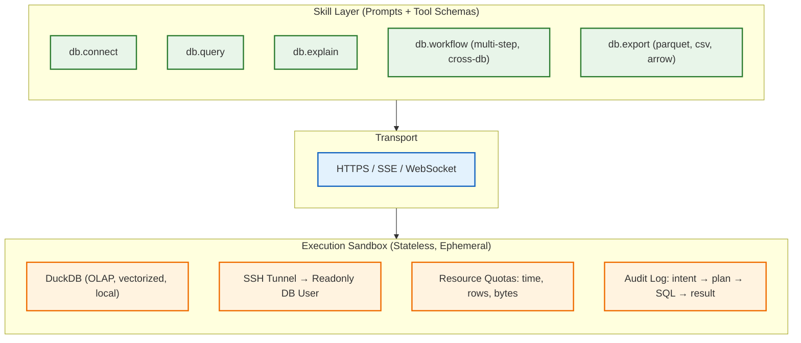

# Agent-Native Database Access: A Different Take

**Source**: [V2EX #1237986](https://www.v2ex.com/t/1237986) — "公司不让装 Navicat 了，就自己写了一个数据库客户端" (DataZen)

---

## The Core Tension

DataZen is a solid *human-facing* DB client (Tauri + Rust + React). But the issue reveals a deeper architectural mismatch:

| Human-Centric GUI | Agent-Centric Interface |
|---|---|
| Click, type, point-and-click | Structured tool calls (JSON in/out) |
| Visual schema browser | Semantic schema retrieval (vector/keyword) |
| SQL editor with autocomplete | NL → SQL generation + validation loop |
| Workflow = YAML DAG saved in UI | Workflow = Skill prompt + tool composition |
| Embedded AI features (hardcoded prompts) | Pluggable Skills (versioned, hot-swappable) |
| Local model runs block UI thread | Async inference + streaming results |

**The GUI is the wrong abstraction for agents.**

---

## What an Agent-Native Stack Looks Like



**Key principles:**

1. **No GUI state** — Agents don’t need windows, tabs, or connection pools they can’t inspect.
2. **Skills over features** — Prompts are code. Version them. Swap them. Test them.
3. **DuckDB as the universal executor** — Attach remote readonly via `postgres_scanner`/`mysql_scanner`/`httpfs`; push down filters; stream Arrow/Parquet back.
4. **SSH tunnel + readonly user** — Network-level enforcement, not app-level trust.
5. **Local models for privacy, remote for power** — Route by query complexity.

---

## The Self-Driving Installation Loop

The ultimate agent-native tool **installs itself**:

```mermaid
sequenceDiagram
    participant Agent
    participant Registry as Official Website / Registry
    participant Sandbox as Execution Sandbox

    Agent->>Registry: GET /skill/db-access (single prompt/manifest)
    Registry-->>Agent: Returns install prompt + tool schemas + security policy
    Agent->>Agent: Parses manifest, plans installation
    Agent->>Sandbox: Provisions DuckDB, SSH config, readonly creds
    Agent->>Sandbox: Validates connectivity, runs smoke tests
    Agent->>Agent: Registers tools (db.connect, db.query, ...)
    Agent->>User: "Ready. What do you want to query?"
```



**No human ops steps.** The manifest contains:
- **Tool schemas** (JSON Schema for each capability)
- **Security policy** (readonly, quotas, allowed networks)
- **Provisioning script** (idempotent, sandboxed)
- **Self-test queries** (verifies end-to-end)
- **Version + signature** (supply-chain trust)

The agent *reads once, installs itself, self-verifies, then owns the capability*.

---

## Why This Matters

- **GUI clients** optimize for *human exploration* (browse, click, export)
- **Agent interfaces** optimize for *composability, auditability, reproducibility*
- **Self-driving tools** optimize for *zero-friction adoption* — the agent is the operator

The former makes a great *viewer* for the latter’s output. The latter makes a terrible *driver* for the former.

---

## Practical Takeaway

If you’re building for agents:
- Expose **thin, typed tool APIs** (not MCP servers with 50 methods)
- Keep **prompt logic out of the binary** — load Skills at runtime
- Make **every execution auditable**: input intent → generated SQL → execution stats → output sample
- **Stream results** — don’t buffer 100k rows into context
- **Ship a self-install manifest**, not a binary + docs

If you’re using agents:
- Don’t wrap a GUI client via MCP and call it “agent-ready”
- Write a Skill that describes *your* schema, *your* conventions, *your* safety rules
- Treat the DB as a **function**, not a **place you visit**

---

## Reference Implementation (Conceptual)

```python
# Skill: db.query
# Input: { intent: str, tables?: str[], max_rows?: int }
# Output: { sql: str, rows: list, stats: {rows_scanned, latency_ms}, truncated: bool }

async def db_query(intent, tables=None, max_rows=1000):
    schema = await retrieve_relevant_schema(intent, tables)
    sql = await llm.generate_sql(intent, schema, dialect="postgres")
    validated = await validate_readonly(sql)
    result = await duckdb.execute(validated, limit=max_rows)
    return format_result(result)
```

---

*Not a product. Not a framework. Just a pattern.
Someday the tooling will catch up.
Until then — write the Skill, not the GUI.*