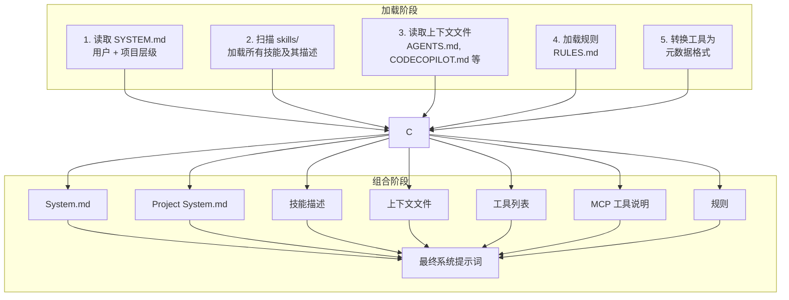
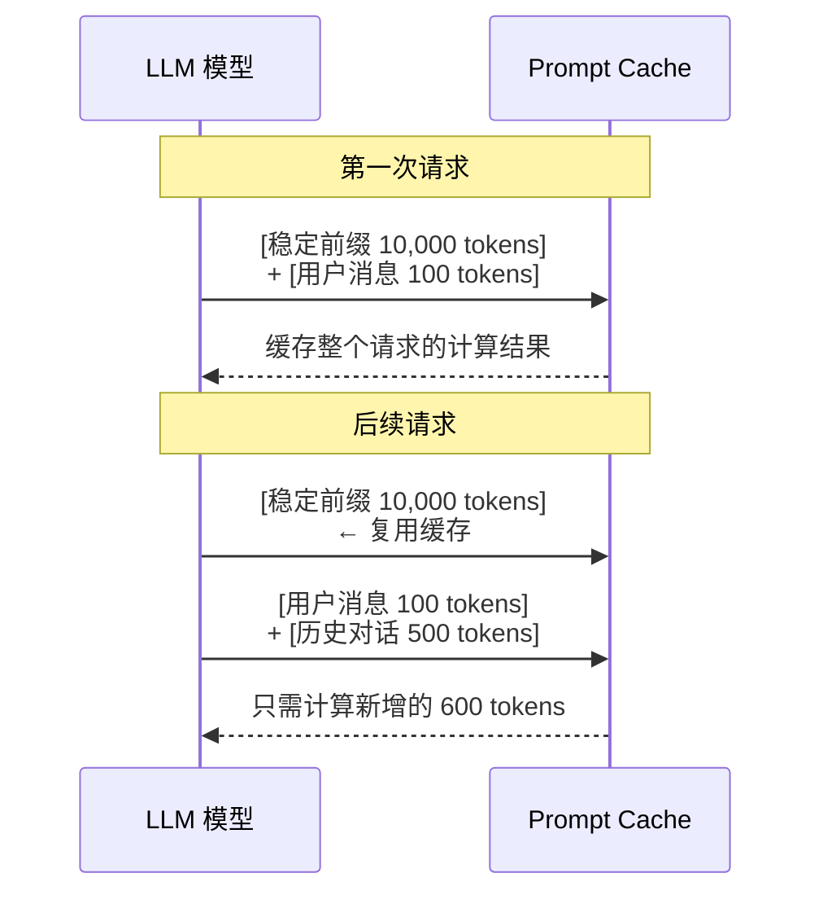
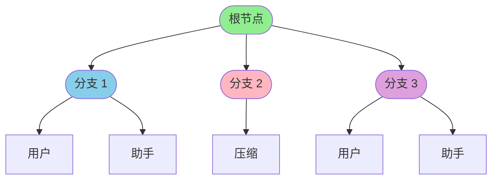
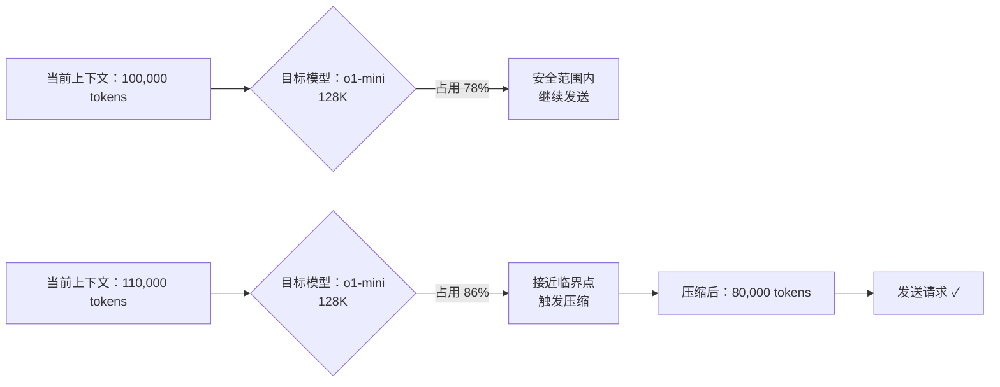
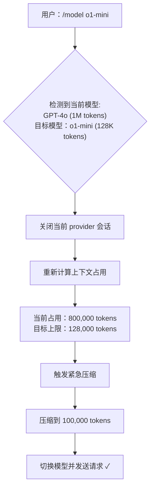
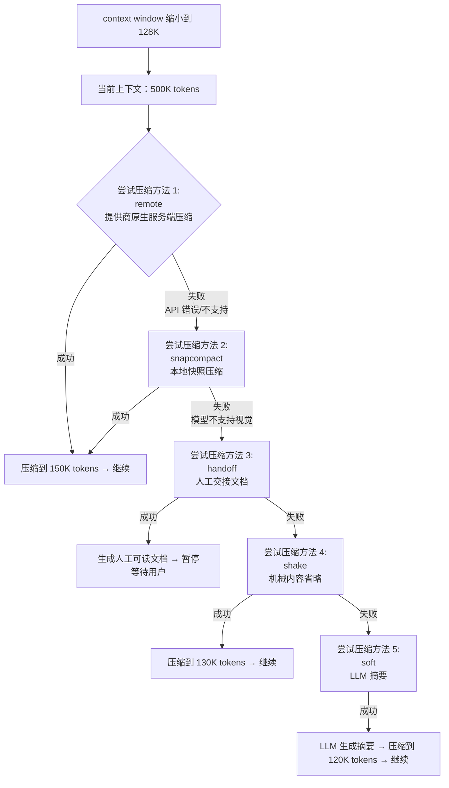
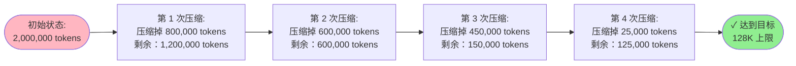
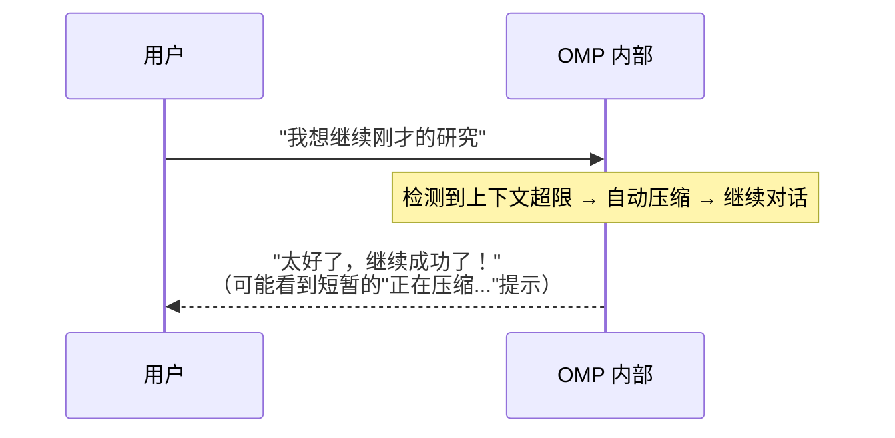

# OMP 核心架构：稳定前缀、对话树与跨模型容错

## 概述

Oh My Pi (OMP) 是一个现代化的交互式 AI 代理框架，其核心设计围绕着三个关键概念：**稳定前缀（Stable Prefix）**、**对话树（Conversation Tree）**和**跨模型容错机制**。本文档深入探讨这些机制的实现原理和设计哲学。

---

## 一、稳定前缀（Stable Prefix）构建机制

### 1.1 什么是稳定前缀？

稳定前缀是指每次 agent 启动时加载的**固定上下文内容**，包括：

- **系统提示词**：来自 `SYSTEM.md` 的用户和项目级指令
- **工具列表**：内置工具、自定义技能、MCP 工具
- **技能描述**：每个技能的 Markdown 说明
- **上下文文件**：`AGENTS.md`、`RULES.md` 等标准配置

### 1.2 构建流程



### 1.3 为什么称为"稳定"？

**稳定性体现在：**

1. **内容不变性**：只要配置文件不变，这部分内容每次都是相同的
2. **位置固定**：总是出现在对话历史的**最前面**（第一个消息）
3. **缓存复用**：LLM 可以缓存这部分 token 的计算结果，后续请求只需计算新增部分

#### Prompt Cache 优化示意



---

## 二、对话树（Conversation Tree）数据结构

### 2.1 树形结构设计

OMP 使用**树形结构**而非线性链表来表示对话历史，这带来了两个关键能力：

1. **分支导航**：支持 `/tree` 命令在不同对话分支间跳转
2. **高效压缩**：可以对子树进行整体摘要

```typescript
// SessionEntry 的核心字段
interface SessionEntry {
  id: string;              // 唯一标识符
  parentId: string | null; // 父节点 ID（根节点为 null）
  type: "message" | "compaction" | "branch_summary" | ...;
  timestamp: Date;
  // ... 其他字段
}
```

### 2.2 路径回溯算法

从当前叶子节点回溯到根节点，构建完整的对话路径：

```typescript
// 在 session-context.ts 中

function buildSessionContext(entries: SessionEntry[]): SessionContext {
  // 从叶子节点向上回溯到根节点
  const path: SessionEntry[] = [];
  const seenPathIds = new Set<string>();
  let current: SessionEntry | undefined = leaf;
  
  while (current && !seenPathIds.has(current.id)) {
    seenPathIds.add(current.id);
    path.push(current);
    current = current.parentId ? byId.get(current.parentId) : undefined;
  }
  path.reverse(); // 现在是从根到叶子的顺序
  
  // 构建 LLM 可见的消息列表
  const messages: AgentMessage[] = [];
  for (const entry of path) {
    messages.push(convertEntryToMessage(entry));
  }
  
  return { messages, ... };
}
```

### 2.3 分支创建和导航



**分支操作：**

```typescript
// 创建新分支
agent.branch({ instructions: "开始新的研究方向" })

// 返回主分支
agent.back()

// 查看树结构
/tree  # 显示所有可用分支
```

---

## 三、跨模型上下文管理

### 3.1 问题挑战

不同模型的 context window 差异巨大：

| 模型 | Context Window |
|------|---------------|
| GPT-4o | 128K tokens |
| Claude 3.5 Sonnet | 200K tokens |
| o1-preview | 200K tokens |
| GPT-1.5M | 1M tokens |
| o1-mini | 128K tokens |

**当用户在 o1-mini（128K）上继续之前在 GPT-4o-Max（1M）上的长时间对话时会发生什么？**

### 3.2 多层防护机制

OMP 设计了三层防护：

#### 第一层：预防性压缩（Proactive）

```typescript
// 在每次发送请求前检查
async checkCompaction(msg: AssistantMessage): Promise<CompactionResult> {
  const contextUsage = this.getContextUsage({ 
    contextWindow: this.model?.contextWindow ?? 0 
  });
  
  if (contextUsage.totalTokens > this.model.contextWindow * 0.9) {
    // 超过 90% 时提前触发压缩
    return await this.triggerCompression(msg);
  }
  
  return { compactionEpoch: 0, continuationScheduled: false };
}
```

**工作流程：**



#### 第二层：恢复性压缩（Reactive）

如果 somehow 还是超了（比如用户手动设置了很大的上下文）：

```typescript
// 检测到 context overflow 错误
if (msg.stopReason === "error" && 
    AIError.isContextOverflow(msg, model.contextWindow ?? 0)) {
  
  // 自动触发压缩并继续
  const compactionTask = this.#maintenance.checkCompaction(msg);
  this.#trackPostPromptTask(compactionTask);
  await compactionTask;
  
  // 告诉用户发生了什么
  this.emitNotice('info', '上下文已压缩以适配模型限制');
}
```

#### 第三层：手动干预

用户可以通过命令手动控制：

```bash
# 手动压缩
/compact [instructions]

# 切换到长上下文模式
/extended-context on  # 启用 1M token 窗口

# 切换到大 context window 模型
/model gpt-4o-max
```

### 3.3 模型切换时的自动调整

```typescript
// 在 agent-session.ts 中
async #reapplyExtendedContextPolicy(): Promise<void> {
  const currentModel = this.model;
  const updated = this.#modelRegistry.find(currentModel.provider, currentModel.id);
  
  // 检测到 context window 变化
  if (updated && updated.contextWindow !== currentModel.contextWindow) {
    await this.#setModelWithProviderSessionReset(updated);
  }
}
```

**模型切换流程：**



---

## 四、崩溃降级处理（Crash Degradation）

### 4.1 压缩方法优先级回退

OMP 支持多种压缩方法，按优先级回退：

```typescript
compaction.methodOrder: [
  'remote',      // 提供商原生的服务端压缩
  'snapcompact', // 本地快照压缩（首选）
  'handoff',     // 人工交接文档
  'shake',       // 机械内容省略
  'soft'         // 软压缩（LLM 摘要）
]
```

### 4.2 降级链路示意图



### 4.3 SnapCompact 详解

**SnapCompact** 是一种创新的本地压缩技术：

```typescript
// 压缩过程
function compressWithContextWindowLimit(context: Message[], limit: number) {
  // 1. 计算需要压缩的部分
  const tokensUsed = calculateTokenUsage(context);
  const excess = tokensUsed - limit;
  
  // 2. 选择要压缩的历史段落
  const segmentsToCompress = selectSegmentsForCompression(context, excess);
  
  // 3. 将文本转为位图图像
  for (const segment of segmentsToCompress) {
    const image = renderAsBitmap(segment, {
      width: 8,      // 8 列
      height: 12,    // 12 行
      colors: ['black', 'white'], // 双色
      fontSize: 8    // 小字体
    });
    
    // 4. 替换原始文本为图像
    context.splice(segment.index, 1, {
      role: 'user',
      content: [{ type: 'image_url', image }]
    });
  }
  
  // 5. 重新计算总 token 数
  return recalculateTotalTokens(context); // 现在 < limit
}
```

**优势：**

1. **零 API 调用**：完全本地执行，不消耗额外 tokens
2. **高压缩率**：文本→图像的转换大幅减少 token 占用
3. **可逆性**：图像可以还原为近似原文（虽然会丢失一些细节）

### 4.4 极端情况处理

**场景：上下文已经严重超限（比如 2M tokens），而目标模型只有 128K**

```typescript
// 检测到严重超限
if (excessTokens > model.contextWindow * 2) {
  // 分批次压缩
  const batches = Math.ceil(excessTokens / model.contextWindow);
  
  for (let i = 0; i < batches; i++) {
    await compressBatch(batch[i]);
    
    // 检查是否还需要继续
    if (currentTokens <= model.contextWindow) break;
  }
}
```

**多次压缩示例：**



---

## 五、设计哲学与工程权衡

### 5.1 对用户透明

OMP 的设计目标是让用户**感觉不到**上下文管理的存在：



### 5.2 性能与准确性的平衡

| 压缩方法 | 速度 | 准确性 | 适用场景 |
|---------|------|--------|---------|
| remote | 慢（需 API） | 高 | 有网络、追求质量 |
| snapcompact | 快（本地） | 中高 | 首选方案 |
| handoff | 即时 | 低 | 需要人工介入 |
| shake | 即时 | 中 | 快速降级 |
| soft | 慢（需 LLM） | 高 | 最后手段 |

### 5.3 跨模型一致性

无论用户使用哪个模型，OMP 的保护机制都是一样的：

```yaml
# 配置示例
compaction:
  enabled: true
  methodOrder: [remote, snapcompact, handoff, shake, soft]
  thresholdTokens: 100000  # 统一阈值，不随模型变化
```

这意味着：
- 用户在 GPT-4o 上积累了 100 万 tokens 的对话
- 切换到 o1-mini（128K）时，OMP 会自动处理
- 切换到 Claude 3.5（200K）时，OMP 也会自动处理
- **配置无需调整，体验保持一致**

---

## 六、总结

OMP 的核心架构体现了现代 AI 应用设计的几个重要原则：

1. **分层抽象**：稳定前缀、对话树、容错机制各司其职
2. **弹性设计**：多层防护确保系统在各种边界条件下都能工作
3. **用户友好**：复杂的内部管理对用户完全透明
4. **跨平台一致**：统一的策略适用于所有模型和设备

这种设计使得 OMP 能够：
- 支持超长对话（数百万 tokens）
- 无缝切换不同能力的模型
- 在资源受限的设备上稳定运行
- 为用户提供流畅的交互体验

正是这些精心设计的机制，让 OMP 成为了一个既强大又可靠的 AI 开发平台。

---

*本文档基于 OMP 源代码分析编写，涵盖了核心的架构设计和运行机制。*