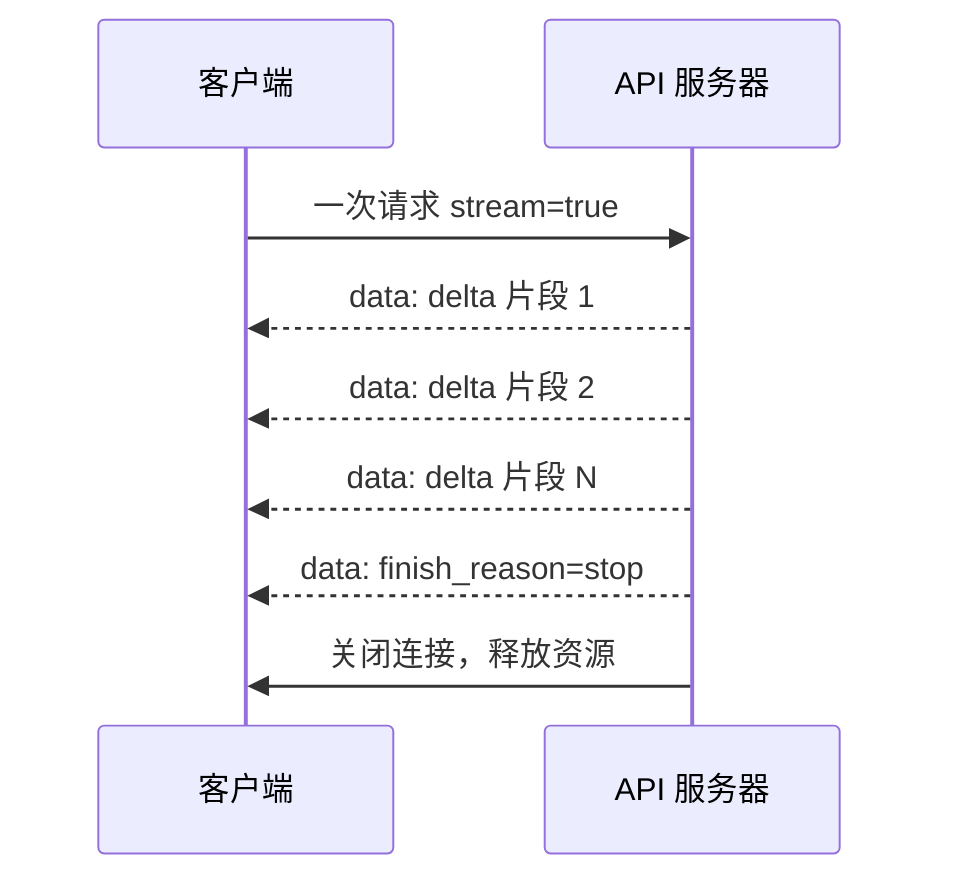
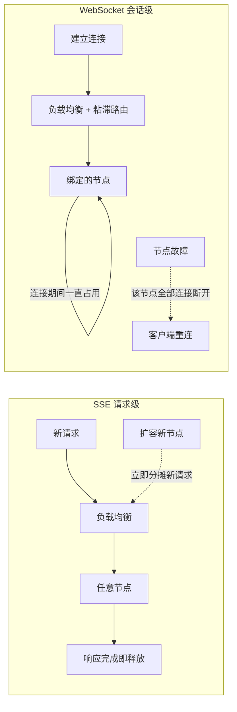
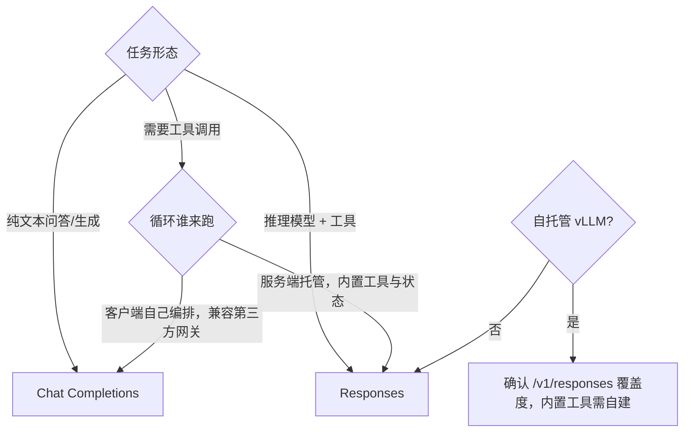

# 从 Chat Completions 到 Responses API: Agent底层接口知识梳理

> 最近在设计一个 agent 应用，选接口时发现自己对底层传输、协议与 API 形态的理解有一串缺口，索性从 Chat Completions 一路追问到 Responses API，把认知补齐。这篇是我梳理后的笔记，给同样在做接口/agent 选型的读者。
>
> 标注约定：**【事实】**＝官方文档或可验证来源；**【厂商宣称】**＝OpenAI 单方数字，无第三方复现；**【推断】**＝我的推理，欢迎指正。

---

## 一、两套接口到底差在哪

| 维度 | Chat Completions | Responses |
|---|---|---|
| 端点 | `/v1/chat/completions` | `/v1/responses` |
| 基本单位 | `messages[]`（role + content） | items（`message` / `function_call` / `function_call_output` / `reasoning` 等联合类型） |
| 系统提示 | `messages` 里的 system | 独立 `instructions` 字段 |
| 多轮状态 | 无状态，每轮重发完整历史 | 可用 `store` + `previous_response_id`（或 Conversations）由服务端串联 |
| 工具编排 | 只返回调用意图，循环由客户端自己写 | 服务端 agent loop：一次请求内模型可多轮调用内置工具（web_search、file_search、code_interpreter、computer use、远程 MCP）及自定义 function |
| 输出取值 | `choices[].message.content` | `output[]` + 便捷字段 `output_text` |
| 已移除参数 | — | `n`（多候选）、`seed` |
| 流式事件 | `chat.completion.chunk` 增量片段 | 结构化语义事件（item 级、delta 级） |

【事实】官方迁移文档明确："Chat Completions remains supported, Responses is recommended for all new projects"；字段映射为 `messages→input`、`max_tokens→max_output_tokens`、`response_format→text.format`。

## 二、Chat Completions 文档里的五类示例是什么

我一开始把官方示例页的 Default / Functions / Image input / Logprobs / Streaming 当成了五种接口，实际上它们**都是 request body 的配置开关**：示例页演示的是"开启某能力时，请求怎么写、响应会长什么样"。

| 示例 | 请求侧关键字段 | 响应侧对应结构 | 典型用途 |
|---|---|---|---|
| Default | `messages` | `choices[].message.content` | 普通对话/生成 |
| Functions | `tools`（旧版 `functions`） | `choices[].message.tool_calls`（旧版 `function_call`） | 让模型返回调用意图，客户端执行后回传结果 |
| Image input | `content` 为数组，含 `image_url` 项 | 仍是 `message.content` | 识图、OCR、图表理解 |
| Logprobs | `logprobs: true` + `top_logprobs` | `choices[].logprobs`（token 级概率） | 置信度分析、分类校准、评测 |
| Streaming | `stream: true` | 多条 SSE chunk，每条含 `delta`，`finish_reason` 收尾 | 打字机式输出、降低首字延迟感知 |

这些开关可以自由组合——比如 Functions + Streaming + Image input 同时开。

## 三、Streaming：一次连接，多次发送

【事实】`stream: true` 时，返回的是 **SSE（Server-Sent Events）**：单次 HTTP 请求 + 响应式持续推送。没有第二协议，就是一条 HTTP 响应不结束，服务器往里持续写 `data: {...}` 行。

要点：**1 次请求连接，N 次推送**；每个 delta 是生成中的增量 token；`finish_reason` 是结束信号。

## 四、长连接的资源账

一个绕不开的问题：SSE 后端一直维持连接，资源什么时候释放？高并发怎么办？

【事实】TCP 连接存活期间必然占用：文件描述符、内核收发缓冲区、socket 状态。**连接不关，这些不释放**——这与同步/异步无关，是操作系统层的事实。

所以高并发下真正要治理的是：

| 风险 | 治理手段 |
|---|---|
| 僵尸连接（客户端早断了） | 写失败即感知（TCP 会报错），配合心跳/空闲超时清理 |
| 慢生成占住连接 | 单请求时长上限，超时主动断开 |
| 连接数打爆 FD 上限 | 服务器级并发上限，超限返回 503 或排队 |
| 异常拖住不释放 | 出错立即断开（快速失败），而不是等生成结束 |

## 五、一个我自己的认知误区：异步不是用来"释放连接"的

我最初的理解是"异步 SSE 更安全"，后来发现这个表述不成立，值得单独写一节。

**误区**：以为异步能帮助"回收连接、释放资源"。
**事实**：连接占用的资源（FD、缓冲区、内核态）跟异步没有任何关系，异步不能回收连接。

异步的真正价值在另一处：

| | 同步阻塞（一线程一连接） | 异步（事件循环 + 协程） |
|---|---|---|
| 一个挂起的流式连接占用什么 | 整个线程（默认栈常达 MB 级） | 一个挂起的协程（KB 级） |
| 其他新请求能否被处理 | 工作线程被占满时，新请求排队甚至被拒 | 事件循环继续接受、分发新请求 |
| 并发密度 | 受限于线程数 | 受限于内存与 FD 上限 |

【推断】准确的说法是：**异步提高的是"同时挂起大量半完成连接"的并发密度，并保证单个慢连接不阻塞新请求的接受与处理**；而"连接占用的资源最终能释放"靠的是超时、上限、快速失败这些治理措施（见 §4），不是异步本身。两者配合，SSE 才能在生产上扛高并发。

## 六、为什么 OpenAI 选 SSE 而不是 WebSocket

同样是长连接协议，为什么不是 WebSocket？【事实/推断，方向可靠】

1. **通信方向匹配**：文本生成是"客户端发一次请求 → 服务器单向推流"。WebSocket 的双向能力在这里是冗余设计。
2. **协议简单**：SSE 就是普通 HTTP 响应；WebSocket 需要升级握手、帧编解码、心跳、重连等一整套状态机。
3. **基础设施免费兼容**：SSE 天然过现有 HTTP 栈——鉴权用 HTTP Header，CDN/代理/负载均衡/限流都按 HTTP 语义工作；WebSocket 在每一层都需要显式配置 Upgrade 透传。

反过来，需要双向实时（协同编辑、游戏、语音通话）的场景，WebSocket 仍是正确选型。

## 七、无状态 vs 有状态：对横向扩展的影响

顺着 §6 再挖一层：**SSE 的"连接"是请求级生命周期（分钟级、结束即释放），WebSocket 的"连接"是会话级生命周期（长存、绑定节点）**。这个差异对扩展性是架构级的。

| 维度 | SSE（请求级） | WebSocket（会话级） |
|---|---|---|
| 滚动更新/扩缩容 | 旧连接自然结束，新请求打到新节点，无需迁移 | 连接必须迁移或断开重连 |
| 节点宕机影响面 | 仅进行中的请求（秒级） | 该节点上的全部长连接 |
| 状态放置 | 无需共享状态 | 通常需要 sticky session 或把会话状态外置（Redis 等） |

【推断】需要诚实补充：sticky session + 状态外置是成熟方案（IM/游戏服务都这么跑），说 WebSocket "不能横向扩展"不成立；准确说法是**扩展复杂度和故障恢复成本更高**。

## 八、为什么又推出 Responses 来替代 Completions

范式演进：从"对话补全"（一问一答的文本生成器）到"agent 原语"（把状态、工具、循环内置到 API 层）。

【事实】Responses 带来的新增能力：

- **服务端状态**：`store`（默认存储）+ `previous_response_id` / Conversations，多轮不用自己搬历史
- **内置工具**：web_search、file_search、code_interpreter、computer use、远程 MCP——在服务端 agent loop 里执行
- **推理项一等公民**：`reasoning` item、`reasoning_effort`、加密推理（跨轮携带推理上下文而不暴露内容）
- **结构化流事件**：item 级语义事件替代裸 delta

【事实】接口确实影响能力释放，官方原文：*"Reasoning models have a richer experience in the Responses API with improved tool usage. **Starting with GPT-5.4, Chat Completions does not support tool calling with `reasoning_effort` values other than `none`.**"* ——推理模型的工具调用能力，在 CC 接口上被硬性砍掉了。

【厂商宣称，未验证】OpenAI 称推理模型在 Responses 上 SWE-bench +3%，前缀缓存利用使成本降 40–80%。这是 OpenAI 内部数字，无第三方复现，我持保留态度。

【事实】Chat Completions **仍在支持中**，官方只说"新项目推荐 Responses"，**没有公布任何弃用时间表**。

## 九、自托管：vLLM 支持到什么程度

【事实，vLLM 官方文档 OpenAI-Compatible Server 页】`vllm serve` 原生支持：

- `/v1/responses`
- `/v1/responses/{response_id}`（取回已存储响应）
- `/v1/responses/{response_id}/cancel`

【推断】自托管 vLLM 的 Responses 与 OpenAI 云端不等价：web_search、code_interpreter、file_search 这些是 **OpenAI 托管服务**，vLLM 上要么没有、要么要自己接；`previous_response_id` 式状态存储的完整度也以官方文档为准。选自托管时，预期应放在"接口形状兼容"，而不是"内置工具全家桶照搬"。

## 十、接口影响模型性能吗？需要为接口单独训练吗？

分三层回答：

1. **模型权重不受接口影响**【事实】：两接口调同一模型，接口是编排层封装。模型看到的最终输入，都会渲染成训练时的 chat template 序列。
2. **接口影响的是"编排质量"而非"模型智力"**【事实+推断】：CC 模式下多轮工具循环由客户端拼装，历史遗漏、截断、格式错误都是应用层 bug 的来源；Responses 把循环和状态放服务端，等价于消除了整类人为编排错误。GPT-5.4 起 CC 上推理模型工具调用被禁用（§8），则是接口直接决定"能力可用集"的硬证据。
3. **是否需要针对接口做训练？**【推断】：不需要"为接口"单独训练——不存在独立的接口适配层要学。需要的是**面向 agentic 任务域的训练**（工具选择、多步规划、结果回读），这类训练成果两种接口都受益。

【未知】开源模型在 vLLM 上跑 `/v1/responses` 与 `/v1/chat/completions` 的 agentic 表现差异，官方没有公开评测。若在意，应在自己的任务集上 A/B。

## 十一、我的接口选型决策框架

结论先行：**选哪个接口是 agent 设计阶段的决策**，且它与"模型训练"分属两个责任面——前者是应用开发者对编排方式/可用能力集的选择，后者是模型供应商对权重的优化，两者解耦。

一页速查：

- **用 CC**：接第三方兼容网关（vLLM/OpenRouter 等）、自己管理历史、简单生成、要 `n` 多候选
- **用 Responses**：新项目 + OpenAI 直连、要内置工具/托管循环/服务端状态、推理模型 + 工具调用（GPT-5.4 后仅此路）
- **无论选哪个**：流式按 SSE 语义理解；并发治理靠超时/上限/快速失败；异步框架解决的是并发密度而非连接释放

---

## 参考官方文档

- OpenAI — Migrate to the Responses API（含 GPT-5.4 工具调用限制、字段映射、store 默认值）: https://developers.openai.com/api/docs/guides/migrate-to-responses
- OpenAI Developers 文档首页: https://developers.openai.com/api/docs/
- Microsoft Learn — 从 Azure OpenAI Chat Completions 迁移到 Responses API: https://learn.microsoft.com/en-us/azure/developer/ai/how-to/azure-openai-to-responses
- vLLM — OpenAI-Compatible Server（Supported APIs 列表，含 /v1/responses 端点）: https://docs.vllm.ai/en/latest/serving/online_serving/openai_compatible_server
- MDN — Server-sent events（SSE 协议语义）: https://developer.mozilla.org/en-US/docs/Web/API/Server-sent_events