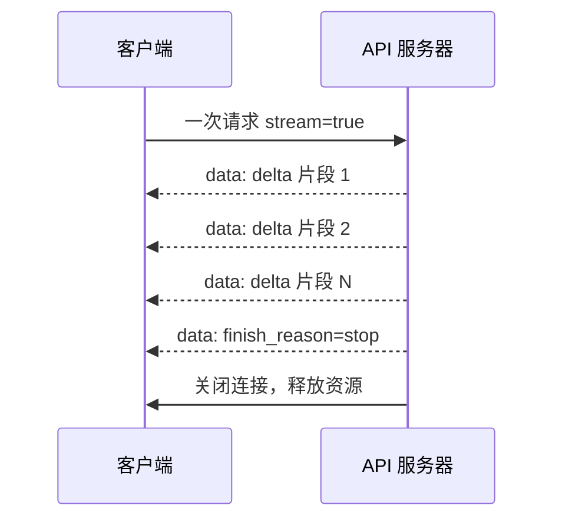
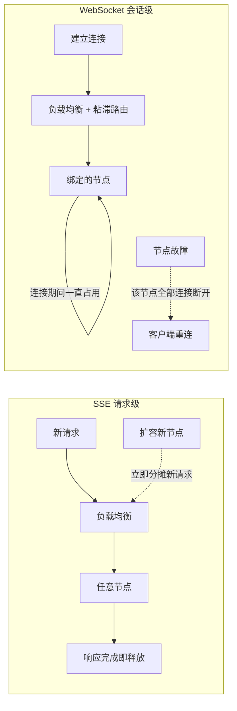
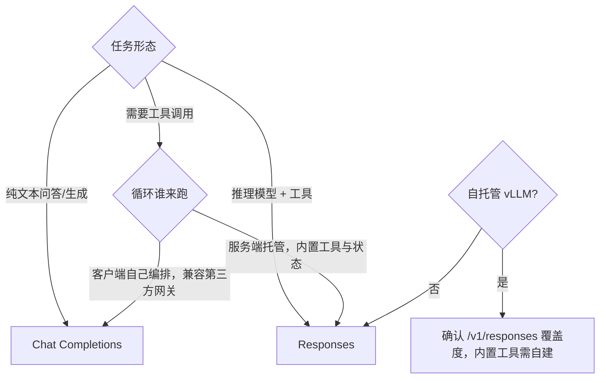
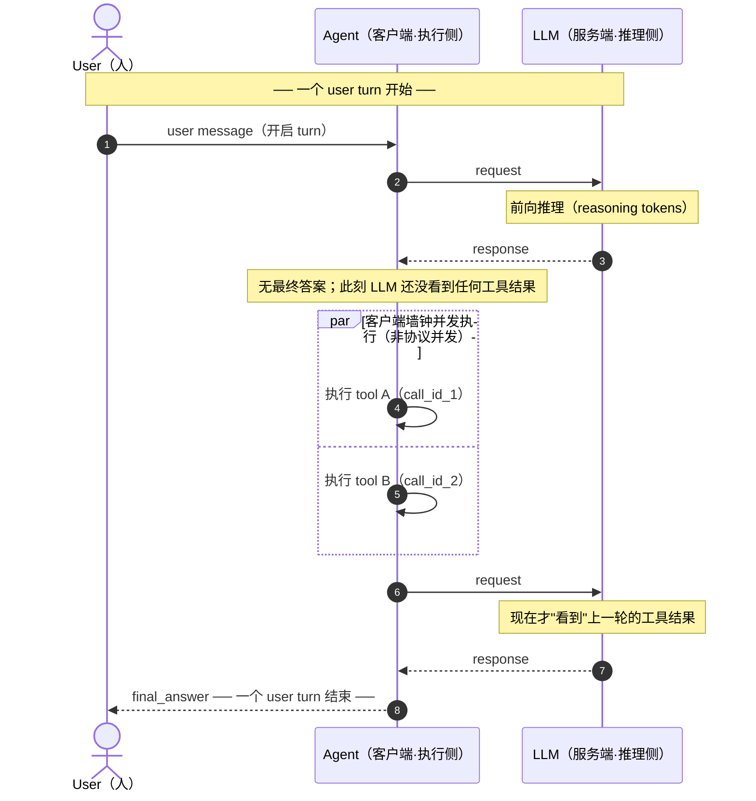
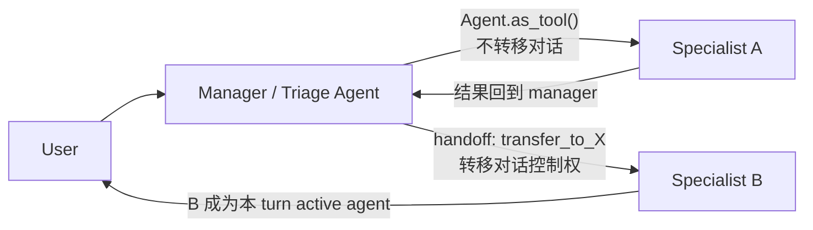

# 从 Chat Completions 到 Responses API: Agent底层接口知识梳理

> 最近在设计一个 agent 应用，选接口时发现自己对底层传输、协议与 API 形态的理解有一串缺口，索性从 Chat Completions 一路追问到 Responses API，把认知补齐。这篇是我梳理后的笔记，给同样在做接口/agent 选型的读者。
>
> 全文按"先讲清两套接口本体（请求怎么组装、响应怎么流式回来），再讲传输架构的账，最后讲自托管与选型"的顺序展开。
>
> 标注约定：**【事实】**＝官方文档或可验证来源；**【厂商宣称】**＝OpenAI 单方数字，无第三方复现；**【推断】**＝我的推理，欢迎指正。

## 目录

- **总览**：两套接口的差异地图
- **一、Chat Completions API：无状态的消息循环**
  - 1.1 request 怎么组装：简单对话 / 复杂对话（工具调用）/ 多轮
  - 1.2 response 与流式 chunk：delta 里到底有什么
  - 1.3 官方示例页的五类"配置开关"
- **二、Responses API：items、服务端状态与 response id**
  - 2.1 input 的完整形态：item 联合类型与全量回放
  - 2.2 为什么推出 Responses 替代 Completions
  - 2.3 response id 细节：作用域、保留期、链式引用
  - 2.4 有状态 vs 无状态：两种都支持
- **三、流式传输：为什么选 SSE**
  - 3.1 SSE 语义：一次连接，多次发送
  - 3.2 为什么不是 WebSocket
  - 3.3 请求级 vs 会话级连接：横向扩展的架构账
  - 3.4 长连接的资源账
  - 3.5 异步不是用来"释放连接"的
- **四、推理框架与自托管：vLLM 支持到什么程度**
- **五、Agent 设计中的接口选型**
  - 5.1 接口与模型训练是两件事
  - 5.2 决策框架与一页速查
- **六、一次完整 turn 的时序**：user / agent / llm 三视图
- **七、tool_call vs subagent**：区别与设计取舍
- **参考官方文档**

---

## 总览：两套接口的差异地图

| 维度 | Chat Completions | Responses |
|---|---|---|
| 端点 | `/v1/chat/completions` | `/v1/responses` |
| 基本单位 | `messages[]`（role + content） | items（`message` / `function_call` / `function_call_output` / `reasoning` 等联合类型） |
| 系统提示 | `messages` 里的 system | 独立 `instructions` 字段 |
| 多轮状态 | 无状态，每轮重发完整历史 | 可用 `store` + `previous_response_id`（或 Conversations）由服务端串联 |
| 工具编排 | 只返回调用意图，循环由客户端自己写 | 服务端 agent loop：一次请求内模型可多轮调用内置工具（web_search、file_search、code_interpreter、computer use、远程 MCP）及自定义 function |
| 输出取值 | `choices[].message.content` | `output[]` + 便捷字段 `output_text` |
| 已移除参数 | — | `n`（多候选，迁移映射表明确）；`seed`（【推断】：Responses 只有单生成，种子无复用意义；三篇官方页未逐字标注"移除"） |
| 流式事件 | `chat.completion.chunk` 增量片段 | 结构化语义事件（item 级、delta 级） |

【事实】官方迁移文档明确："Chat Completions remains supported, Responses is recommended for all new projects"；字段映射为 `messages→input`、`max_tokens→max_output_tokens`、`response_format→text.format`。

下面先深入两套接口本体，再回到这张表里每一行的来龙去脉。

## 一、Chat Completions API：无状态的消息循环

### 1.1 request 怎么组装

CC 的请求核心就是一个 `messages[]` 数组，每个元素是 `{role, content}`。三种典型场景：

**简单对话**——system 定人设，user 提问：

```json
POST /v1/chat/completions
{
  "model": "gpt-4o",
  "messages": [
    {"role": "system", "content": "你是一个严谨的助手"},
    {"role": "user", "content": "你好"}
  ]
}
```

**复杂对话（工具调用）**——请求里声明 `tools`，模型返回"调用意图"而不是答案：

```json
{
  "model": "gpt-4o",
  "messages": [{"role": "user", "content": "北京今天天气怎么样？"}],
  "tools": [{"type": "function", "function": {"name": "get_weather", "parameters": {"type": "object", "properties": {"city": {"type": "string"}}}}}]
}
```

响应的 `choices[0].message.tool_calls` 带 `call_id`、`name`、`arguments`。客户端自己执行工具，然后把**调用意图 + 执行结果**都追加进 messages，重新发一次请求：

```json
{
  "messages": [
    {"role": "user", "content": "北京今天天气怎么样？"},
    {"role": "assistant", "tool_calls": [{"id": "call_123", "function": {"name": "get_weather", "arguments": "{\"city\":\"北京\"}"}}]},
    {"role": "tool", "tool_call_id": "call_123", "content": "{\"temp_c\": 25}"},
    {"role": "user", "content": "适合穿什么？"}
  ]
}
```

【事实】工具结果必须放在 `role: "tool"` 的消息里，用 `tool_call_id` 与调用意图关联；模型要的"最终答案"要等下一轮响应才出现。

**多轮场景**——服务端不保存任何历史，每一轮都由客户端把之前所有轮次（user 消息、assistant 回复、tool 消息）重发一遍。【事实】这是 CC 无状态设计的本质：状态完全在客户端手里。

### 1.2 response 与流式 chunk

非流式响应取 `choices[0].message`（`content` 或 `tool_calls`），`finish_reason` 标明结束原因：`stop` / `tool_calls` / `length`。

流式（`stream: true`）时返回 SSE，每条 `data:` 是一个 `chat.completion.chunk`，内容在 `choices[0].delta` 里增量到达：

| delta 字段 | 装什么 | 拼完后是什么 |
|---|---|---|
| `delta.content` | 正文文本增量 | assistant 的最终回答（final answer） |
| `delta.tool_calls` | 工具调用分片（`index`/`call_id`/`name`/`arguments` 逐段到达） | 完整的 `tool_calls` 结构 |

最后一条 chunk 用 `finish_reason` 收尾（`stop` 或 `tool_calls`），然后连接关闭。

【事实】值得专门指出：**OpenAI 官方 CC 的 chunk 里没有 reasoning 内容项**。推理模型（o 系列等）的思考过程不流式返回，只在 `usage.completion_tokens_details.reasoning_tokens` 里报 token 计数。"chunk 里含 reasoning"是 Responses API 的行为——它的 output 里有独立的 `reasoning` item，流式事件也是 item 级语义事件（见第二节）。这是我最初把两套接口的流式行为混在一起的一个点。

### 1.3 官方示例页的五类"配置开关"

我一开始把官方示例页的 Default / Functions / Image input / Logprobs / Streaming 当成了五种接口，实际上它们**都是 request body 的配置开关**：示例页演示的是"开启某能力时，请求怎么写、响应会长什么样"。

| 示例 | 请求侧关键字段 | 响应侧对应结构 | 典型用途 |
|---|---|---|---|
| Default | `messages` | `choices[].message.content` | 普通对话/生成 |
| Functions | `tools`（旧版 `functions`） | `choices[].message.tool_calls`（旧版 `function_call`） | 让模型返回调用意图，客户端执行后回传结果 |
| Image input | `content` 为数组，含 `image_url` 项 | 仍是 `message.content` | 识图、OCR、图表理解 |
| Logprobs | `logprobs: true` + `top_logprobs` | `choices[].logprobs`（token 级概率） | 置信度分析、分类校准、评测 |
| Streaming | `stream: true` | 多条 SSE chunk，每条含 `delta`，`finish_reason` 收尾 | 打字机式输出、降低首字延迟感知 |

这些开关可以自由组合——比如 Functions + Streaming + Image input 同时开。

## 二、Responses API：items、服务端状态与 response id

### 2.1 input 的完整形态：item 联合类型与全量回放

`input` 是联合类型，三种写法【事实】：

1. **单个字符串**（快捷写法）：`input: "tell me a joke"`
2. **message 对象数组**：`[{"role": "user", "content": "..."}, {"role": "assistant", "content": "..."}]`——和 CC 的 `messages[]` 对位
3. **item 数组**（完整形态）：除 message 外还接受 `function_call`、`function_call_output`、`reasoning`、`item_reference` 等 item 类型

所以"复杂对话能不能一次传全量历史"的答案是：**能，和 CC 完全同效**。官方 function calling 示例就是这个模式——把上一轮响应的 `output` 原样放回 `input`，再补上工具结果：

```python
# 下一轮请求：把上一轮完整 output 原样放回 input
input_messages += response.output          # 含 message、reasoning、function_call item

for tool_call in response.output:
    if tool_call.type != "function_call":
        continue
    result = call_function(tool_call.name, json.loads(tool_call.arguments))
    input_messages.append({
        "type": "function_call_output",
        "call_id": tool_call.call_id,      # 用 call_id 与调用意图关联
        "output": json.dumps(result),
    })
```

与 CC 的差别不在"能不能装下"，而在 **item 粒度更细**：`reasoning` item、`item_reference` 是 CC `messages[]` 里没有的（CC 连 reasoning 内容都不暴露，见 1.2）。

### 2.2 为什么推出 Responses 替代 Completions

范式演进：从"对话补全"（一问一答的文本生成器）到"agent 原语"（把状态、工具、循环内置到 API 层）。

【事实】Responses 带来的新增能力：

- **服务端状态**：`store`（默认存储）+ `previous_response_id` / Conversations，多轮不用自己搬历史
- **内置工具**：web_search、file_search、code_interpreter、computer use、远程 MCP——在服务端 agent loop 里执行
- **推理项一等公民**：`reasoning` item、`reasoning_effort`、加密推理（跨轮携带推理上下文而不暴露内容）
- **结构化流事件**：item 级语义事件替代裸 delta

【事实】接口确实影响能力释放，官方原文：*"Reasoning models have a richer experience in the Responses API with improved tool usage. **Starting with GPT-5.4, Chat Completions does not support tool calling with `reasoning_effort` values other than `none`.**"* ——推理模型的工具调用能力，在 CC 接口上被硬性砍掉了。

【版本漂移·2026-09 官方文档】OpenAI 官方文档现已把最新推理模型更新为 **GPT-6 Astra**（示例与选型都以 `gpt-6-astra` 为准），上段 GPT-5.4 的限制仍是历史事实且仍在生效。做选型或自测时以 `gpt-6-astra` 实测为准，别把 5.4 当最新模型。

【厂商宣称，未验证】OpenAI 称推理模型在 Responses 上 SWE-bench +3%，前缀缓存利用使成本降 40–80%。这是 OpenAI 内部数字，无第三方复现，我持保留态度。

【事实】Chat Completions **仍在支持中**，官方只说"新项目推荐 Responses"，**没有公布任何弃用时间表**。

### 2.3 response id 细节：作用域、保留期、链式引用

围绕 response id 我澄清过四个问题，答案都收在这里：

**谁来生成？**【事实】response id（`resp_` 前缀）由服务端创建 Response 时生成并随响应返回，客户端从不生成。id 的生成与去重机制文档没有描述，属服务端实现细节——但客户端无需也无从关心。

**作用域是什么？**【事实】一个 Response 对象 = **一次 API 调用的完整产物**：`output[]` 里聚合了这一轮产出的全部 item（message、reasoning、function_call…）加上 usage 等元数据。"一个 turn 产生一个 response id"成立。流式场景要分两层：SSE 传输时收到的是 delta/语义事件，客户端把它们归并成 item；最终落账的仍是 response 对象及其 output items——事件是传输形态，item 是语义单位，response id 指向的是后者所在的整体。

**服务端存什么？**【事实】`store: true`（默认）时，Response 对象在服务端保存 **30 天**：dashboard 可查，`GET /v1/responses/{id}` 可取回。下一轮请求带 `previous_response_id: <上一轮 id>`，服务端自动把这条链上的历史拼进上下文，客户端只发增量输入。另有第三条路 **Conversations API**：把 messages、tool calls、tool outputs 存成一个跨会话的持久对象，有自己的 durable id，适合多设备/多任务共享同一份对话。

> 【事实·补充，2026-09 官方文档】两条常被忽略的细节：
> 1. **Conversations API 的 item 不受 30 天 TTL 约束**——挂在 Conversation 对象上的 item 会永久保存，而 `previous_response_id` 链上的 Response 仍是 30 天。要长期共享对话，选 Conversations。
> 2. **`previous_response_id` 不带顶层 `instructions`**——用链式引用时，稳定的 `instructions` 仍需在每轮重发，否则系统提示会丢失。

**省不省 token？**【事实】不省。官方明说：即使走 `previous_response_id` 链，链上之前所有轮次的 input token 照常计入 input 计费。服务端记历史省的是客户端代码，不是上下文。

### 2.4 有状态 vs 无状态：两种都支持

【事实】无状态是一等公民：设 `store: false`，响应不落库，多轮上下文由客户端手动放进 `input`——和 CC 同一玩法。官方无状态示例就是"把上一轮 `response.output`（含加密 reasoning item）整体追加回 `input`，再发下一轮"。

| | 有状态 | 无状态 |
|---|---|---|
| 参数 | `store: true` + `previous_response_id` | `store: false` + 客户端自己拼 `input` |
| 历史在哪 | 服务端（保存 30 天） | 客户端 |
| 推理模型注意 | reasoning 由服务端自动带上 | 必须原样回放全部 output（含加密 reasoning item），否则链路断裂 |
| 适合 | 快速原型、单服务单链路 | 自管历史/自建压缩、多网关、不想被 30 天窗口绑住 |

【推断】所以选 Responses 并不意味着"接受服务端托管状态"——两种模式都在，真正的差别是**历史放在谁手里**：CC 只能客户端拼，Responses 给了"放服务端"这个选项，且放服务端也不省 token。

## 三、流式传输：为什么选 SSE

### 3.1 SSE 语义：一次连接，多次发送

【事实】`stream: true` 时，返回的是 **SSE（Server-Sent Events）**：单次 HTTP 请求 + 响应式持续推送。没有第二协议，就是一条 HTTP 响应不结束，服务器往里持续写 `data: {...}` 行。



要点：**1 次请求连接，N 次推送**；每个 delta 是生成中的增量 token；`finish_reason` 是结束信号。

### 3.2 为什么不是 WebSocket

同样是长连接协议，为什么不是 WebSocket？【事实/推断，方向可靠】

1. **通信方向匹配**：文本生成是"客户端发一次请求 → 服务器单向推流"。WebSocket 的双向能力在这里是冗余设计。
2. **协议简单**：SSE 就是普通 HTTP 响应；WebSocket 需要升级握手、帧编解码、心跳、重连等一整套状态机。
3. **基础设施免费兼容**：SSE 天然过现有 HTTP 栈——鉴权用 HTTP Header，CDN/代理/负载均衡/限流都按 HTTP 语义工作；WebSocket 在每一层都需要显式配置 Upgrade 透传。

反过来，需要双向实时（协同编辑、游戏、语音通话）的场景，WebSocket 仍是正确选型。

### 3.3 请求级 vs 会话级连接：横向扩展的架构账

顺着 3.2 再挖一层：**SSE 的"连接"是请求级生命周期（分钟级、结束即释放），WebSocket 的"连接"是会话级生命周期（长存、绑定节点）**。这个差异对扩展性是架构级的。



| 维度 | SSE（请求级） | WebSocket（会话级） |
|---|---|---|
| 滚动更新/扩缩容 | 旧连接自然结束，新请求打到新节点，无需迁移 | 连接必须迁移或断开重连 |
| 节点宕机影响面 | 仅进行中的请求（秒级） | 该节点上的全部长连接 |
| 状态放置 | 无需共享状态 | 通常需要 sticky session 或把会话状态外置（Redis 等） |

【推断】需要诚实补充：sticky session + 状态外置是成熟方案（IM/游戏服务都这么跑），说 WebSocket "不能横向扩展"不成立；准确说法是**扩展复杂度和故障恢复成本更高**。

### 3.4 长连接的资源账

一个绕不开的问题：SSE 后端一直维持连接，资源什么时候释放？高并发怎么办？

【事实】TCP 连接存活期间必然占用：文件描述符、内核收发缓冲区、socket 状态。**连接不关，这些不释放**——这与同步/异步无关，是操作系统层的事实。

所以高并发下真正要治理的是：

| 风险 | 治理手段 |
|---|---|
| 僵尸连接（客户端早断了） | 写失败即感知（TCP 会报错），配合心跳/空闲超时清理 |
| 慢生成占住连接 | 单请求时长上限，超时主动断开 |
| 连接数打爆 FD 上限 | 服务器级并发上限，超限返回 503 或排队 |
| 异常拖住不释放 | 出错立即断开（快速失败），而不是等生成结束 |

### 3.5 异步不是用来"释放连接"的

我最初的理解是"异步 SSE 更安全"，后来发现这个表述不成立。

**误区**：以为异步能帮助"回收连接、释放资源"。
**事实**：连接占用的资源（FD、缓冲区、内核态）跟异步没有任何关系，异步不能回收连接。

异步的真正价值在另一处：

| | 同步阻塞（一线程一连接） | 异步（事件循环 + 协程） |
|---|---|---|
| 一个挂起的流式连接占用什么 | 整个线程（默认栈常达 MB 级） | 一个挂起的协程（KB 级） |
| 其他新请求能否被处理 | 工作线程被占满时，新请求排队甚至被拒 | 事件循环继续接受、分发新请求 |
| 并发密度 | 受限于线程数 | 受限于内存与 FD 上限 |

【推断】准确的说法是：**异步提高的是"同时挂起大量半完成连接"的并发密度，并保证单个慢连接不阻塞新请求的接受与处理**；而"连接占用的资源最终能释放"靠的是超时、上限、快速失败这些治理措施（见 3.4），不是异步本身。两者配合，SSE 才能在生产上扛高并发。

## 四、推理框架与自托管：vLLM 支持到什么程度

【事实，vLLM 官方文档 OpenAI-Compatible Server 页】`vllm serve` 原生支持：

- `/v1/responses`
- `/v1/responses/{response_id}`（取回已存储响应）
- `/v1/responses/{response_id}/cancel`

【推断】自托管 vLLM 的 Responses 与 OpenAI 云端不等价：web_search、code_interpreter、file_search 这些是 **OpenAI 托管服务**，vLLM 上要么没有、要么要自己接；`previous_response_id` 式状态存储的完整度也以官方文档为准。选自托管时，预期应放在"接口形状兼容"，而不是"内置工具全家桶照搬"。

【未知】开源模型在 vLLM 上跑 `/v1/responses` 与 `/v1/chat/completions` 的 agentic 表现差异，官方没有公开评测。若在意，应在自己的任务集上 A/B。

## 五、Agent 设计中的接口选型

### 5.1 接口与模型训练是两件事

分三层回答：

1. **模型权重不受接口影响**【事实】：两接口调同一模型，接口是编排层封装。模型看到的最终输入，都会渲染成训练时的 chat template 序列。
2. **接口影响的是"编排质量"而非"模型智力"**【事实+推断】：CC 模式下多轮工具循环由客户端拼装，历史遗漏、截断、格式错误都是应用层 bug 的来源；Responses 把循环和状态放服务端，等价于消除了整类人为编排错误。GPT-5.4 起 CC 上推理模型工具调用被禁用（见 2.2），则是接口直接决定"能力可用集"的硬证据。
3. **是否需要针对接口做训练？**【推断】：不需要"为接口"单独训练——不存在独立的接口适配层要学。需要的是**面向 agentic 任务域的训练**（工具选择、多步规划、结果回读），这类训练成果两种接口都受益。

### 5.2 决策框架与一页速查

结论先行：**选哪个接口是 agent 设计阶段的决策**，且它与"模型训练"分属两个责任面——前者是应用开发者对编排方式/可用能力集的选择，后者是模型供应商对权重的优化，两者解耦。



一页速查：

- **用 CC**：接第三方兼容网关（vLLM/OpenRouter 等）、自己管理历史、简单生成、要 `n` 多候选
- **用 Responses**：新项目 + OpenAI 直连、要内置工具/托管循环/服务端状态、推理模型 + 工具调用（GPT-5.4 后仅此路）
- **无论选哪个**：含 tool_call 的复杂历史都能一次传全量；流式按 SSE 语义理解；并发治理靠超时/上限/快速失败；异步框架解决的是并发密度而非连接释放

---

## 六、一次完整 turn 的时序：user / agent / llm 三视图

> 本节补充：把"一个 user turn"从开启到收尾的完整时序拆开，明确 **user / agent（客户端·执行侧）/ llm（服务端·推理侧）** 三个角色在每个节点做什么。标注约定同前：**【事实】**＝官方文档可验证；**【推断】**＝我的推理。

### 6.1 先定义两个粒度：turn 与 request

**【事实】** 这是最易混淆、也最关键的一刀：

| 粒度 | 定义 | 边界 |
|---|---|---|
| **user turn（对话轮）** | 用户发一条消息 → agent 最终回一条答案 | 由 **多次** LLM 调用组成 |
| **request（请求）** | 一次 `POST /v1/chat/completions` 或 `/v1/responses` | ＝ **一个** assistant turn |

一句话：**user turn ⊃ request**。所谓"一个完整 turn 里 LLM 的 response 包含 reasoning / message / tool_calls / final_answer"，是**逻辑上的合并视图**；落到 API 上，它们是**多个** response 拼出来的：

- **一个 request 的响应 ＝ 一个 assistant turn**：要么 `content`（message），要么 `tool_calls`，**不会同时**给出最终答案和"还要继续调用"的意图。
- **final_answer 是最后一个 request 的响应**，不在产生 `tool_calls` 的那一次里。
- **reasoning** 是单次响应的内部产出：Responses 里作为独立的 `reasoning` item 出现在 `output[]`（可选 `summary`，无状态模式带 `encrypted_content`）；CC 里 OpenAI **不返回**推理 token（隐藏）。

### 6.2 三个角色

| 角色 | 位置 | 职责 |
|---|---|---|
| **User（用户）** | 人 | 发消息开启 turn；消费最终答案 |
| **Agent（客户端·执行侧）** | 应用代码 | **跑循环**：拼请求 → 发请求 → 执行工具 → 把结果塞回下一次请求 → 判断何时结束 |
| **LLM（服务端·推理侧）** | OpenAI / vLLM 等 | **只做一次前向**：吃当前 context，产出一个 assistant turn（`content` 或 `tool_calls`） |

**【事实】** "谁跑循环"是核心分野：OpenAI 五步工具流明确 *execute code on the application side*；vLLM 文档也把 *handle the tool calls in your application logic* 列为 caller 责任。**LLM 从不执行工具，也不拼下一次请求。**

### 6.3 完整时序（含并行工具调用）



**【事实】** 图里三条要点都有官方依据：

1. **并行＝"单轮多个 tool_call"**：官方原话 *"The model may choose to call multiple functions in a single turn"*；`parallel_tool_calls:false` 可强制零或一个。
2. **工具结果在"下一次请求"才进模型**：官方五步流的第 3、4 步——应用侧执行 → *第二次请求*带上 tool output。模型永远滞后一轮才看到结果。
3. **绑定靠 `call_id`**：Responses 把 `function_call_output{call_id, output}` 追加进 `input`；CC 用 `role:"tool"` + `tool_call_id`。顺序/并行由执行侧决定，**协议层是串行的**。

### 6.4 每个节点，三个角色分别做什么

| 节点 | User | Agent（客户端） | LLM（服务端） |
|---|---|---|---|
| ① 开启 | 发 user message | 组装 request #1（历史 + tools 全量打包） | — |
| ② 推理 | — | 等待 | 前向推理，产出 reasoning（内部/可选摘要） |
| ③ 出调用 | — | 收到 `tool_calls × N` | 输出 N 个调用意图（可并行），**不含最终答案** |
| ④ 执行 | — | **并行执行** N 个工具，收集输出 | —（此刻无感知） |
| ⑤ 回填 | — | 拼 request #2：历史 + 按 `call_id` 绑定的工具结果 | — |
| ⑥ 出答案 | — | 收到 `content` | 看到上一轮工具结果，产出 final_answer |
| ⑦ 收尾 | 消费答案 | 结束循环（或继续下一轮工具） | — |

**【推断】** ③–⑥ 会按需重复：只要 response 里还有 `tool_calls`，agent 就回到 ④。**终止条件**＝"某次 response 只有 `content`、没有 `tool_calls`"。

### 6.5 CC vs Responses：时序一样，循环归属不同

| 维度 | CC（`/v1/chat/completions`） | Responses（`/v1/responses`） |
|---|---|---|
| 循环归属 | **客户端**（agent 自己写） | 可**服务端托管**（内置工具 / agent loop） |
| 历史维护 | 客户端攒 `messages[]`，每轮全量重发 | `store:true` + `previous_response_id`，或手动回传 `output[]` |
| 工具结果形态 | `role:"tool"` + `tool_call_id` | `function_call_output{call_id, output}` |
| reasoning 回传 | OpenAI 不返回推理 token | **官方建议**把 reasoning item 一起回传（可用 `previous_response_id`） |

**【事实】** "谁跑循环"变了，"对模型逐轮调用"没变。即便 Responses 服务端托管，模型侧仍是"一次一个 assistant turn、工具结果下一轮才进"。

### 6.6 一页速记

- **user turn** 由 **多个 request** 组成；**request ＝ 一个 assistant turn**。
- **LLM 只产一个 turn**：`content` 或 `tool_calls`，二者不同时给出最终答案。
- **工具执行 100% 在 agent 侧**；结果**滞后一轮请求**才进模型。
- **并行＝单轮内多个 `tool_call` + 客户端并发执行**，协议层始终串行。
- **终止**＝某次 response 只有 `content`。

## 七、tool_call vs subagent：区别与设计取舍

> 本节补充：既然 `tool_call` 已经能做很多事，为什么 agent 还要有 `spawn_subagent`？两者区别是什么？subagent 的设计取舍在哪？标注约定同前：**【事实】**＝官方文档可验证；**【推断】**＝我的推理。

### 7.1 一句话：叶子 vs 子树

| | tool_call | subagent |
|---|---|---|
| 本质 | 一个原子动作，输入→输出明确 | 一个会**自己决策、自己循环**的独立 agent |
| 谁在推理 | 父模型自己推理后决定下一步 | subagent 有**自己的推理链**，父模型只看结果 |
| 上下文 | 由调用方完全指定 | 有**自己的**上下文（自己的历史、自己的文档） |
| 模型/工具 | 绑定父模型的 toolset | 可用**不同**模型、不同工具、不同 system prompt |
| 结构 | 扁平 | 可**递归嵌套**（子 agent 能再 spawn 子子 agent） |
| 执行 | 同步阻塞，等结果 | 可**异步/后台**跑，父模型不必等 |
| 并行 | N 个调用＝N 个操作，但**一个大脑**串行等 | N 个＝N 个**独立推理进程**，真并发 |

**【事实】** 但有个诚实的边界：**subagent 在协议层常常"就是"一个 tool_call**。OpenAI Agents SDK 原话：

> *"Handoffs are represented as tools to the LLM. So if there's a handoff to an agent named `Refund Agent`, the tool would be named `transfer_to_refund_agent`."*

即 handoff 对 LLM 暴露成 `transfer_to_<agent>` 这个 tool。**所以区别在抽象层，不在 wire level**——能不能 spawn subagent 取决于框架有没有这个抽象；但"subagent 内部是一次独立前向、维护自己的上下文"是它和 tool_call 的能力边界。

### 7.2 官方给的两条正交路：agents-as-tools vs handoffs

**【事实】** OpenAI Agents SDK 把"subagent"拆成两种模式（`Agent orchestration` 文档）：

| 模式 | 机制 | 何时用（官方原文意译） |
|---|---|---|
| **Agents as tools** | manager 保留对话控制权，用 `Agent.as_tool()` 调 specialist | 要一个 agent 拥有最终答案、汇总多个 specialist、集中执行 guardrails |
| **Handoffs** | triage 路由到 specialist，specialist 成为**本 turn 的 active agent** | 要 specialist 直接应答、prompt 聚焦、或切换 active instructions |

> *"Use agents as tools when a specialist should help with a bounded subtask but should not take over the user-facing conversation. Use handoffs when routing itself is part of the workflow..."*



**【事实】** SDK 还区分**编排层**：*orchestrating via LLM*（模型自己 plan/handoff）vs *orchestrating via code*（`asyncio.gather` 并行、chaining、evaluator loop）。后者更确定、更快更省。

#### 7.2.1 跨厂商术语对照：没有统一标准

"handoff" 是 OpenAI 的命名选择，不是通用词。各家说法【事实·2026-09 核对】：

| 厂商 | 术语 | 备注 |
|---|---|---|
| OpenAI | handoff / agents-as-tools | 两条正交路，两个开关都给 |
| Anthropic | subagent / delegate | managed-agents 文档**不用 "handoff"**；coordinator 始终保留控制权、委派后回报——更像 agents-as-tools，无独立 handoff 概念 |
| LangGraph / LangChain | subgraph / tool node / agent node | 【印象·未逐页核】 |
| MCP | 纯 tool_call 范式 | 【印象·未逐页核】 |

【推断】正在形成的概念轴（软共识，非标准）：

- **根本轴：tool_call（叶子动作）vs subagent（子树/委派 agent，有自己的上下文）**。
- **wire level 上 subagent 常被实现为 tool_call**——区别在抽象层，不在协议层（呼应 §1 结论）。
- **handoff = 用 tool_call 暴露的 subagent 路由变体**（转移对话控制权）。

所以准确说法：**"要不要转移控制权"这个旋钮，OpenAI 给了两个开关（handoff 转移 / agents-as-tools 保留），Anthropic 偏固定（保留 + 委派回报）。跨厂商读文档时，先映射到"叶子 vs 子树 + 控制权是否转移"这两个维度，再对号入座，别被各家命名带偏。**

### 7.3 上下文继承：默认继承，但可裁剪

**【事实】** 这直接回答"subagent 生成时是否集成 parent 上下文"：

- **handoff 默认继承**：*"When a handoff occurs, it's as though the new agent takes over the conversation, and gets to see the entire previous conversation history."*
- **可裁剪**：`input_filter`（过滤传给下一个 agent 的输入）、`RunConfig.nest_handoff_history`（把可摘要的历史压成 ordered summary segments）、`RunConfig.handoff_history_mapper`。
- **agents-as-tools 默认不转移对话**：`Agent.as_tool()` 用于 *"structured input for a nested specialist without transferring the conversation"*。

所以准确说法不是"subagent 一定不继承 parent 上下文"，而是：

> **handoff 默认给全档案，可用 `input_filter`/`nest_handoff_history` 裁成简报；agents-as-tools 默认只给简报。继承与否是设计旋钮，OpenAI 两头都给了。**

### 7.4 缓存账：继承 vs 不继承

**【事实】** OpenAI prompt caching 文档说清三件事：

1. 缓存的是 *"unchanged tokens at the beginning of a prompt"*（即稳定前缀），含 instructions、developer messages、**tool definitions**、conversation history。
2. *"Cache reuse requires the entire rendered prefix to match."*
3. 关于 agent 的关键一句：*"Agents API model calls use the same prompt-caching behavior... Reusing context within a session can preserve a shared prompt prefix, but maintaining a session doesn't guarantee a cache hit. See ... **subagent accounting**."*

由此【推断】：

- **继承 parent 上下文**（handoff 默认）→ 复用 parent 的 stable prefix → **有机会**命中共享缓存前缀（但官方明说"不保证"）。
- **不继承**（agents-as-tools / `input_filter`）→ subagent 用自己的小 stable prefix → 输入小、聚焦、prefill 便宜，但拿不到 parent 的前缀复用。
- **省钱主体在 parent 的推理循环**（大前缀 × 多次复用），subagent 是小计算。所以"隔离"通常更优，而不是"违反稳定前缀哲学"——**每个 agent 有自己的 stablePrefix + appendOnly log，哲学各自满足**。

### 7.5 subagent 设计取舍总表

| 维度 | 隔离（不继承 parent） | 共享（继承 parent） |
|---|---|---|
| 上下文大小 | 小 | 大 |
| prefill 成本 | 低 | 高 |
| 前缀缓存 | 各用各的小前缀 | 有机会复用 parent 大前缀（不保证） |
| 聚焦度 | 高（无噪声） | 低（可能被无关历史稀释） |
| 协作 | 需共享 workspace/memory 间接同步 | 直接可见 |
| 失败隔离 | 好 | 差 |
| 典型实现 | `Agent.as_tool()` / `input_filter` | handoff 默认 |

### 7.6 怎么选

- **tool_call**：动作单一、边界清晰、要父模型全程可控 → 取数、跑命令、查库。
- **agents-as-tools**：specialist 处理 bounded subtask、不要它接管用户对话、要 manager 汇总。
- **handoffs**：路由本身就是 workflow、要 specialist 接管本 turn。
- **编排层**：要确定/快/省 → 用 code 编排（`asyncio.gather`、chaining、evaluator loop）；要开放任务自主规划 → 交给 LLM 编排。

### 7.7 一页速记

- **tool_call 是叶子，subagent 是子树**；但 subagent 在 wire level 常就是 `transfer_to_X` 这类 tool_call。
- **两条正交路**：agents-as-tools（不转移对话）vs handoffs（转移对话）。
- **上下文**：handoff 默认继承全档案，可 `input_filter`/`nest_handoff_history` 裁成简报；agents-as-tools 默认只给简报。
- **缓存**：继承有机会复用 parent 稳定前缀（不保证），不继承各用各的小前缀；省钱主体在 parent 循环。
- **选型**：单动作→tool_call；bounded subtask→agents-as-tools；路由接管→handoffs。

## 参考官方文档

- OpenAI — Migrate to the Responses API（含 GPT-5.4 工具调用限制、字段映射、store 默认值）: https://developers.openai.com/api/docs/guides/migrate-to-responses
- OpenAI — Conversation state（previous_response_id / store / Conversations API / 30 天保留 / 链式计费）: https://developers.openai.com/api/docs/guides/conversation-state
- OpenAI — Function calling（function_call_output + call_id 回传、output 全量回放示例）: https://developers.openai.com/api/docs/guides/function-calling
- OpenAI Developers 文档首页: https://developers.openai.com/api/docs/
- Microsoft Learn — 从 Azure OpenAI Chat Completions 迁移到 Responses API: https://learn.microsoft.com/en-us/azure/developer/ai/how-to/azure-openai-to-responses
- vLLM — OpenAI-Compatible Server（Supported APIs 列表，含 /v1/responses 端点）: https://docs.vllm.ai/en/latest/serving/online_serving/openai_compatible_server
- MDN — Server-sent events（SSE 协议语义）: https://developer.mozilla.org/en-US/docs/Web/API/Server-sent_events
- OpenAI Agents SDK — Agent orchestration（agents-as-tools vs handoffs、LLM/code 编排）: https://openai.github.io/openai-agents-python/multi_agent
- OpenAI Agents SDK — Handoffs（transfer_to_X、input_filter、nest_handoff_history）: https://openai.github.io/openai-agents-python/handoffs/
- OpenAI Agents SDK — Tools（Agents as tools / Agent.as_tool）: https://openai.github.io/openai-agents-python/tools/
- OpenAI — Prompt caching（前缀缓存、subagent accounting）: https://developers.openai.com/api/docs/guides/prompt-caching
- vLLM — Tool Calling（caller 责任：定义 tools / 带上下文 / 应用侧处理）: https://docs.vllm.ai/en/latest/features/tool_calling