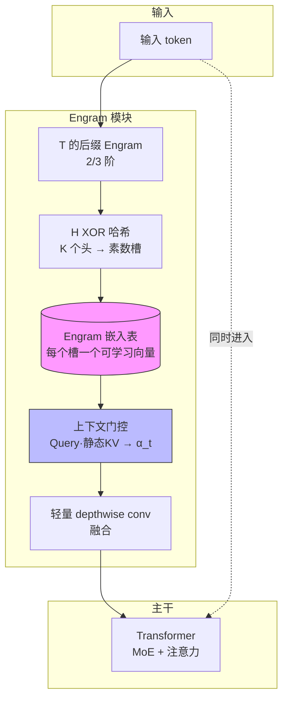
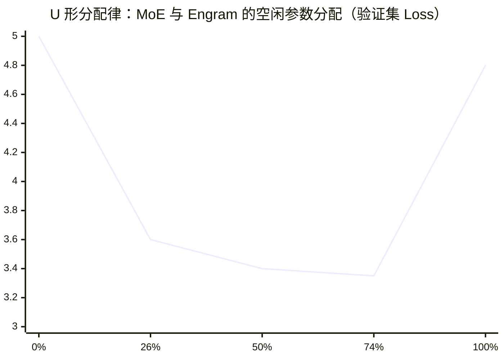
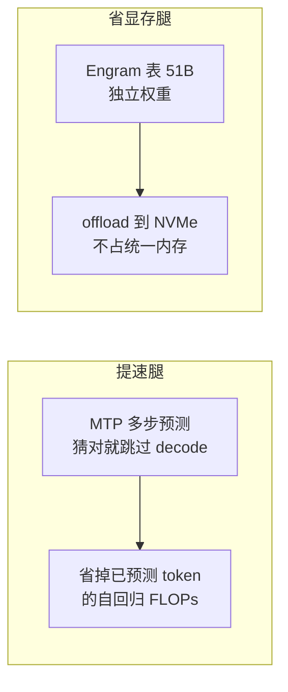
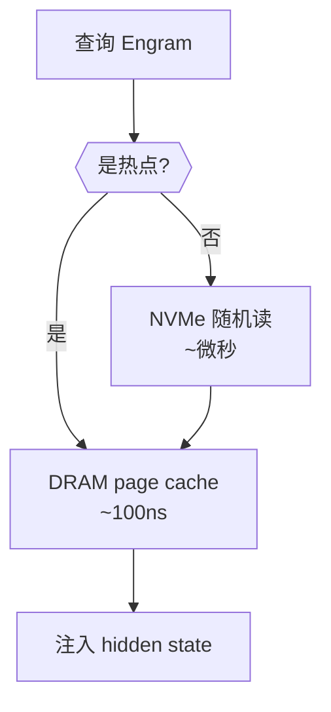

# 工程师视角解读: Engram + MTP (Qwen Next架构) 如何让本地模型提速 + 省显存

> 从 DeepSeek Engram 论文到 Qwen3.8-Flash-Next 的落地，讲清楚 Engram 查表到底解决了什么、怎么算、怎么 offload。
> 本文为技术解读，**标注了「事实」与「推断」**，方便你核对原始来源。

---

## TL;DR

- Transformer 没有"原生知识查找"，静态知识全靠注意力 + 前馈网络用**计算**慢慢拼出来。
- **Engram 查表**是稀疏性的**第二条轴**：套路化、静态的局部模式（命名实体、固定短语）O(1) 查表，把算力留给真正的推理。
- 它和 MoE 的**条件计算**互补：MoE 负责"条件推理"，Engram 负责"条件记忆"。
- 工程落地：Engram 表是**独立权重**，可 offload 到 NVMe——让**小显存也能跑大模型**。

---

## 1. Engram 是什么？

经典 n-gram 嵌入（如 ELMo）是把 n 个连续词映射成一个向量，喂给模型。Engram 把它现代化成**条件记忆模块**，干四件事：



1. **词表压缩**：NFKC 归一化 + 小写等，把语义等价的 token 合并成规范 ID（DeepSeek 压掉 23%）。
2. **多头哈希**：每个 Engram 阶数用 K 个头映射到素数大小的表，用 multiplicative-XOR hash。
3. **上下文门控**：检索出的静态 embedding 当 Key/Value，当前 hidden state 当 Query 做注意力式门控——静态记忆是"无上下文先验"，这一步给它加上下文。
4. **多分支 + 卷积融合**：插进主干的不同分支里。

**关键事实**：Engram 查表在推理时**几乎不增加 FLOPs**（每 token 只花 O(d)），但**访存有开销**。

---

## 2. 为什么要用它？——U 形分配律（Sparsity Allocation Law）

### 2.1 核心直觉

MoE 的"空闲参数"（没被选中的 expert）是**不花钱**的。问题是：这笔免费预算该分给 MoE 还是给 Engram？

### 2.2 U 形曲线

定义分配比：

```
ρ = 分给 MoE 的空闲参数 / 总空闲参数 Psparse   ∈ [0, 1]
```

- ρ = 1 → 全是 MoE（纯计算）
- ρ = 0 → 全是 Engram（纯查表）
- 中间 → 混合

在**严格等参数量、等 FLOPs** 下，把 Psparse 在这两者间滑动，画验证集 loss——是一条 **U 形曲线**：两头都更差，中间混合点最好。



> x 轴刻度：纯 Engram (ρ=0) → 混合低 → 混合中 → Engram-27B (ρ≈74%) → 纯 MoE (ρ=100%)。

**含义**：同样的参数和算力预算下，"计算 + 查表"混合结构严格胜过把预算全押在 MoE 上。

### 2.3 怎么算出 Engram 槽位数？

`Psparse` = MoE 里没被选中的 expert 参数。Engram 表容量 = `(1 − ρ) × Psparse`，**每个槽一个可学习向量 = 参数**。

以 **Engram-27B** 为例：

- 从 72 个 routed expert 减到 55 个，省下的参数 → **5.7B 的 Engram 模块**。
- 5.7B = `(1 − ρ) × Psparse`，ρ = 74.3% → 反推 Psparse ≈ 22B，MoE 部分 ≈ 16.5B。

**要点**：不是"挑哪 26% 做表"，而是"表开多大"。表是规则哈希结构，覆盖整个 Engram 空间，内容在预训练里学出来——**热点由 Zipf 分布自然沉淀**，不需要人工选。

---

## 3. DeepSeek Engram vs Qwen3.8-Flash-Next

| 维度 | DeepSeek Engram | Qwen3.8-Flash-Next |
|---|---|---|
| 角色 | **预训练模块**（省算力） | **推理时**实时查的"长期记忆" |
| 是否影响生成 | 否 | 是，注入到 hidden state |
| 表大小 | 5.7B | **51B** |
| 插入层 | Layer 2 和 6/15 两段 | **Layer 2 单独**（`layers.1.ple.ngram_embedding`） |
| 阶数 | 2/3-gram | bigrams/trigrams（2/3）✓ |
| 门控 | 上下文门控 α_t + depthwise conv | 未见（名为 **PLE**） |
| 词表压缩 | NFKC 归一化 | 未提及 |

**结论**：**概念同源，实现不同。** Qwen 官方 model card 基本在致敬 Engram：

> "N-gram Embedding... requires less computation and is more amenable to offloading than MoE. By indexing with short n-grams, this approach makes parameter scaling highly efficient for memory-constrained accelerators."

但 Qwen 是**独立设计**：只插一层、表大 9 倍、叫 PLE（Prompt-Learned Embedding，**推断**）。它更像是"学 Engram 思路，自己再造一个更轻/更大的版本"，而非直接搬实现。

> ⚠️ 关于 Qwen Engram 的门控/哈希/PLE 机制，来自 model card 和 tensor 路径名，**不是 Qwen 技术报告确认的**，标注为推断。

---

## 4. Qwen3.8-Flash-Next：Engram + MTP 做提速 + 省显存

### 4.1 两个机制，各管一摊



| 机制 | 主要贡献 | 次要贡献 |
|---|---|---|
| **Engram (PLE)** | **省显存**——102GB 表 offload 到 NVMe | 注入知识、让模型"知道" |
| **MTP + token skipping** | **提速**——猜对就跳过 decode | 省算力 |
| **Ultra-Sparse MoE** | 两者都不是 | 3.7% 激活率，底子省 |

### 4.2 常见误解澄清

**误解 1**："Engram 加快返回速度"
- **错**。Engram 省的是**预训练算力**（Multi-Query NIAH 只用了基线 82% 的预训练 FLOPs），不是 token/sec。自回归生成的串行瓶颈查表救不了。

**误解 2**："第一个 token 匹配到整词，省了好几次自回归"
- **错**。生成时 Engram 只能看到已生成的后缀，"Alexander the Great" 的 3-gram 要到第 3 个 token 才凑齐。查表**不产出 token**，"Great" 仍在位置 i+1 正常 decode。

**误解 3**："Engram 比 MoE 省算力 = 省掉 decode 算力"
- **错**。Engram 每 token 只花 O(d)，MoE 是 O(k×F×seq)。用 Qwen 数字算（seq_len=256）：

```
MoE（11 激活 expert × 48 层）≈ 1.7 亿 FLOPs/token
Engram 门控（layer 2，O(d)）≈ 5120 FLOPs/token
差距 ≈ 3.3 万倍
```

"less computation" 是**替换成本**的对比——用 Engram 扛静态知识比开 MoE 便宜 3 万倍，**不是省 base compute**。真正省 decode 的是 **MTP**。

### 4.3 为什么 Engram 不"跳过"生成？

Engram 是**注入器**，不是 token 生成器。它让模型"知道该来 Great"，但模型还得自己吐出 "Great"，并继续写"Great 之后"（开口部分）。MTP 才负责"跳过已确定 token"。

---

## 5. 社区案例：NVMe offload，DGX Spark 单机跑

### 5.1 真实部署

Qwen3.8-Flash-Next 的 Engram 表：

- **原始 BF16**：128 shards × 2,500,012 行 × 160 列 = **102.4 GB**
- **NVFP4 量化**：~51 GB

**推荐（需要 prefix caching 的多轮 / agent 场景）：`blazux/qwen3.8-Flash-DGX`（PLE mmap）**。它 patch 官方 vLLM 镜像，把 51B PLE 表用 **mmap 从 NVMe 直接 serve**——权重降到 ~75 GiB，KV pool 到 ~680k tokens，500k context，确定性 greedy，已被独立复现（其 [issue #1](https://github.com/blazux/qwen3.8-Flash-DGX/issues/1)）。

推荐理由是**其它 vLLM 路线的 prefix caching 是坏的**：

- **官方 recipe 镜像直接崩**：`--enable-prefix-caching` + 多轮对话（不同长度共享前缀）→ GDN 路径 `CUBLAS_STATUS_INTERNAL_ERROR` / illegal memory access，可复现（[vllm#54173](https://github.com/vllm-project/vllm/issues/54173)，open）。
- **不崩也可能白开**：这个模型上单开 `--enable-prefix-caching` 默认 `mamba_cache_mode=none`，GDN state 不可缓存，实测 0 hits / 813 queries；需再加 `--mamba-cache-mode align`，且 <1600 token 的 prompt 仍命中不了（dolf3131 仓库实测）。
- blazux 修了这条链上的 block-size bug（每次 cache hit 会静默恢复**全零 Mamba state**），prefix caching 真正可用。

> ⚠️ vllm#54173 针对官方 recipe 镜像；其它 vLLM-based 仓库是否各自 patch 过此 bug，未逐一验证（推断：README 没提的默认中招）。SGLang 路线不走这条 GDN 路径，不受该 crash 影响。

### 5.2 为什么能 work

Engram 访问是 **Zipf 分布**，热点条目被 OS **页缓存**吸回 DRAM（~100ns），冷条目才回 NVMe（~微秒）。所以命中路径是：



> 注意：DGX Spark 入门版（Jetson Orin）只有 32GB，装不下这张表。能跑的是 **DGX Spark Pro**（128GB 级统一内存）。

---

## 6. 工程要点与注意事项

1. **Engram 是独立权重，天生可 offload**——这是它能省显存的前提。
2. **offload 到 DRAM 是甜点**（论文实测 2.8% 吞吐损失）；但"再往磁盘推"只对"表比内存还大"才有意义——DGX Spark 就是这种情况。
3. **量化是硬门槛**：NVFP4 把 102GB → 51GB，否则根本装不进小显存。
4. **提速靠 MTP，省显存靠 Engram offload**——两条腿，别混。
5. **事实 vs 推断**：Engram 的插入层、表大小、offload 方案来自 model card / 社区仓库（事实）；PLE 机制、门控、哈希细节来自 tensor 路径名（推断），需核对 Qwen 技术报告。

---

## 参考文献

- DeepSeek Engram 论文：https://github.com/deepseek-ai/Engram/blob/main/Engram_paper.pdf
- Qwen3.8-Flash-Next model card：https://huggingface.co/Qwen/Qwen3.8-Flash-Next
- Qwen 技术报告：https://github.com/QwenLM/Qwen3.8-Flash-Next/blob/main/tech_report.pdf
- Engram knowledge injector：https://github.com/ortegaalfredo/ngram-knowledge-injector
- DGX Spark 部署：https://github.com/dolf3131/qwen3.8-flash-next-dgx-spark
- NVMe PLE cache：https://github.com/Felliks/qwen38-flash-next-one-dgx-spark