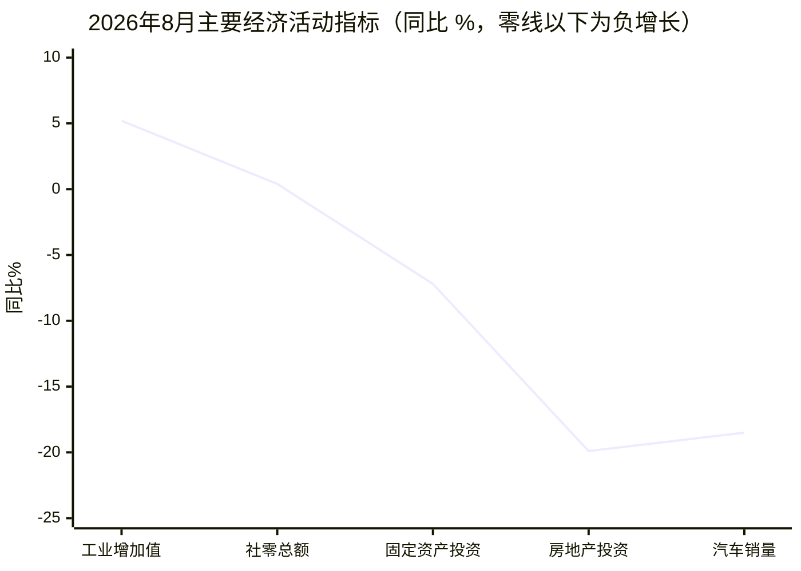
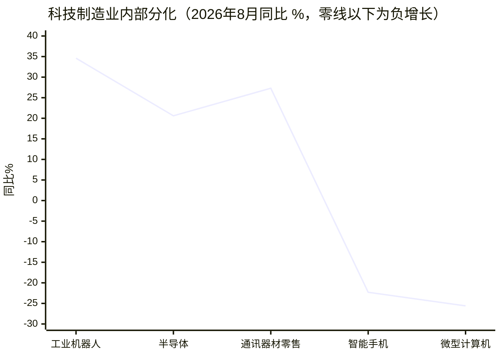
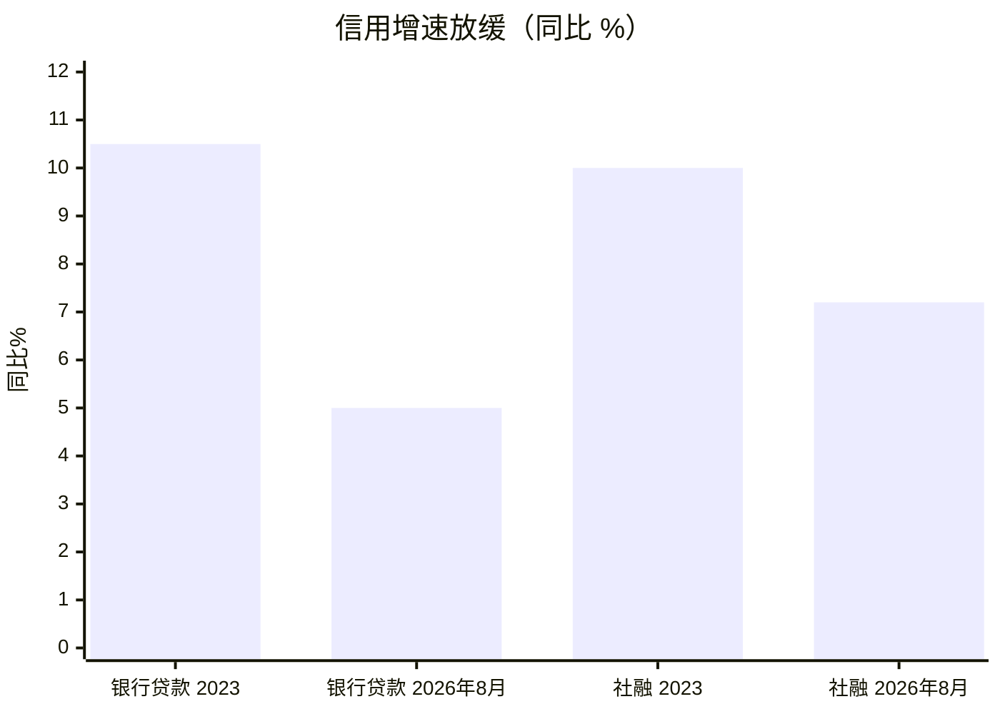
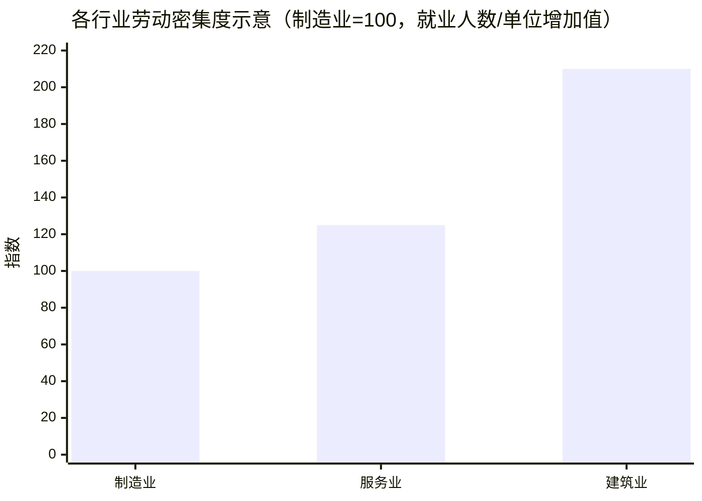
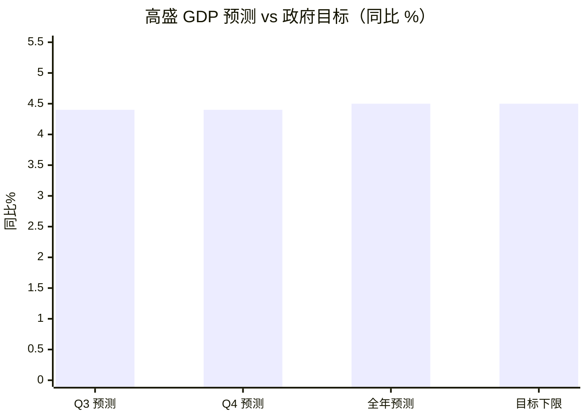
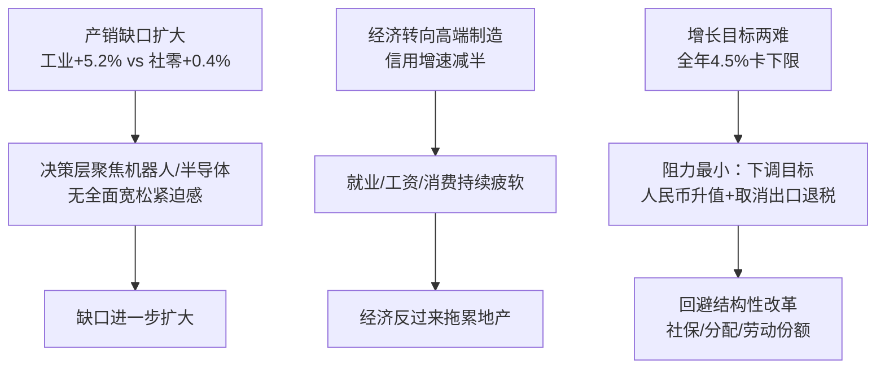

# 高盛《China Matters: 阻力最小的路径》精读

> China Matters: Path of Least Resistance 

> url: https://drive.google.com/file/d/1h3ihFayNbzb83YlD8JN6kYh6MqsgA24v/view?usp=sharing	

> 原文：Goldman Sachs Global Investment Research, Economics Research
> 作者：Hui Shan（闪辉）, Goldman Sachs (Asia) L.L.C.
> 日期：2026 年 9 月 20 日
> 说明：本文为对该付费研报的中文提炼与重述，非逐句翻译；图表根据报告披露的数据重绘，标注"示意"的为根据文字描述绘制的示意图。

报告标题里的 "Path of Least Resistance"（阻力最小的路）在正文里出现了五次——每一次出现，都是在说**决策层会选容易的选项，而不是对的选项**。全文四个部分，层层递进讲的是同一件事：K 型分化不是意外，是政策选择的结果。

---

## 一、产销缺口继续扩大

8 月数据：工业增加值同比 +5.2%（7 月为 4.5%），社会消费品零售总额同比 +0.4%（7 月为 0.6%）。主要经济活动指标中，只有出口和工业产出增速超过 5%，国内需求指标大多录得显著同比下滑。

报告挖了一个关键细节：**官方数据可能低估了真实的供需缺口**。8 月限额以上（大型）零售商销售额同比 **-4%**，而限额以下（小型）零售商为 **+3%**——小零售商采用抽样估算，数据天生更平滑、在下行周期里显得更"抗跌"。这意味着 0.4% 的社零增速高估了真实消费，实际缺口比纸面上更大。

分化不仅存在于"生产 vs 消费"之间，也存在于行业内部：

报告还点名了 9 月 15 日统计局发布会的选择性表述：谈工业时只提机器人和半导体、不提智能手机和微型计算机；谈社零时只提通讯器材、不提汽车。**因为永远有拿得出手的高增长板块可讲，决策层感受不到加码宽松的紧迫感**——除非就业市场急剧恶化。阻力最小的路：缺口继续扩大。

---

## 二、房地产：从"地产拖累经济"到"经济拖累地产"

国际经验显示，大型房地产泡沫破裂通常持续约六年，实际房价从峰值下跌 30% 左右。按 2021 年见顶计算，中国楼市到 2027 年应接近底部，实际房价按高盛的追踪已下跌超过 30%。

但报告认为中国可能走不出这条典型路径。对比美国 2007 年见顶后的经验：虽然房价见顶后前几年通胀回落，但随后通胀回升，就业市场恢复、工资增速正常化、租金回升，经济整体在修复。而中国房价见顶五年后，**就业市场依然疲软甚至走弱，租金同比仍为 -0.6%（2026 年 8 月）**。

过去五年是地产拖累经济，现在方向反过来了：**就业、工资增长、租金正在反过来拖累地产复苏**。

政策面上，决策层无意大幅宽松刺激住房需求；近期限制开发商融资的政策，会先压制土地出让和地方政府收入，短期对楼市是净负面。一线城市新房价格 1～8 月上涨 2%，但二三线城市继续下跌。阻力最小的路：一线和顶级地段之外，房价继续走弱。

---

## 三、结构转型的就业代价：对就业的伤害大于对 GDP

银行贷款增速从 2023 年的 10% 以上降至 2026 年 8 月的 **5%**；即使计入地方化债的政府债券置换，社融增速也从接近 10% 降至 **7.2%**。潘功胜的解释是：这是结构转型的自然结果——地产和基建是信用密集型行业，AI 和高端制造更依赖股权和公司债，贷款增速放缓不必然拖累 GDP。报告认为这个说法有道理。

*注：2026年8月为报告披露值；2023 年报告表述为"10%以上"/"接近10%"，图中取示意值。*

但同一逻辑下，转型对就业是负面的：**单位增加值对应的就业人数，服务业比制造业高 20% 以上，建筑业高出一倍以上**。

*注：根据报告"服务业高20%以上、建筑业高一倍以上"的文字描述绘制的示意图。*

转向高端制造能保住出口和 GDP 数字，但就业、工资收入和消费会持续疲软。扭转这一趋势需要系统性地改革社保、改善收入分配、提高劳动收入占 GDP 比重——报告原话是，这是"多年甚至几十年的工程，目前几乎看不到快速推进的迹象"。

---

## 四、增长目标的两难

政府债券发行正在提速，"六网"基建加码（水网、新型电网、算力网、下一代通信网、地下管网、物流网，7 月底以来国务院已就其中多项开会部署）。即便如此，高盛预测 Q3、Q4 实际 GDP 均为 4.4%，全年 4.5%，**正好卡在政府 4.5～5.0% 目标区间的下限**。

*注：政府目标区间为 4.5～5.0%。*

两难在于：GDP 增长目标是整个经济计划体系的指挥棒，换成就业等其他目标会面临执行难题；但每年保目标又逼着靠投资（见效快、政府可控），拖延再平衡。而"2035 年收入翻一番"的长期目标需要 2025～2035 年均增长 4.17%，目标不敢大砍。

报告把政策选项按"阻力"排了序：

- **难的选项**：大幅扩张财政刺激消费（怕债务——广义财政赤字占 GDP 双位数，自 2015 年每年如此）；或把财政支出从投资转向消费（怕 GDP 立竿见影下滑，而社保见效要慢得多）。
- **容易的选项**：人民币渐进升值、继续取消更多产品的出口增值税退税（过去一年已对光伏、电池动手），用来管理庞大的贸易顺差和贸易摩擦。

阻力最小的路：**逐年下调年度增长目标**，例如 2027 年从"4.5～5.0%"降到"4.5% 左右"。12 月政治局会议和中央经济工作会议会有更多信号。

---

## 全文逻辑一张图

## 一句话总结

报告通篇的潜台词：决策层知道问题在哪（就业、收入分配、社保），也知道药方是什么，但每个药方的政治和财政成本都太高，于是每次都选阻力最小的路——而阻力最小的路，恰好就是让 K 型分化继续扩大的路。

## 延伸讨论：阻力最小的路，通向哪里

*以下为讨论观点，非报告原文。*

"对内阻力最小的路，对外恰恰是阻力最大的路"——这可能是整件事最值得玩味的一点。在国内，保制造、压利率、化债，动的都是老百姓的蛋糕，不动体制内的既得利益，所以阻力最小。但这条路的出口就是把过剩产能往外倒，于是外部反制（关税、去风险、反补贴调查）成了必然。这时候"相信后人的智慧"就从一句调侃变成了真实的政策逻辑：把国内矛盾转化成对外矛盾，能拖一年是一年。

不过"唯一能选择的"这个说法，可以再精确一点：不是没有别的选项（发钱促消费、户籍改革、国企分红充社保，方案都在纸面上），而是**所有备选方案都要动体制内既得利益的蛋糕**——地方政府的土地财政、产业政策的审批权、国企的垄断租金。所以准确说，是"在不动既得利益的前提下唯一能选的"。路径依赖一旦形成，改弦更张的政治成本比硬着头皮走下去更高，这才是真正的锁定。

至于"倾销摧毁他国制造业"，有一半是事实（欧盟对电动车反补贴、美国关税，针对的就是产能过剩），另一半是叙事——比较优势下的正常出口和倾销之间的线，经济学家自己都吵不清。但反制是真实发生的，而且反制反过来又给国内叙事加料："外部打压我们，所以更要自力更生搞高端制造"——闭环了。

---

*精读整理：Muse，2026 年 9 月。数据来源为报告原文及其中引用的 CEIC、NBS、Haver Analytics。*
