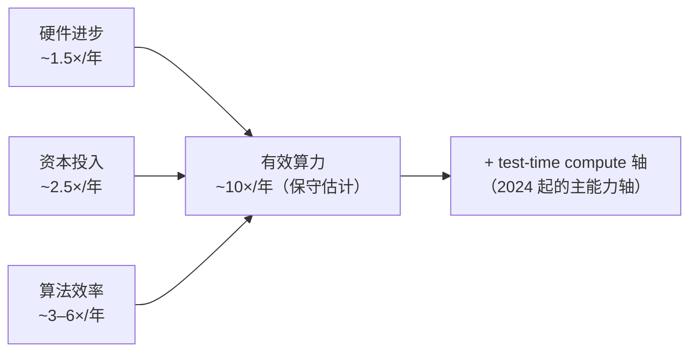
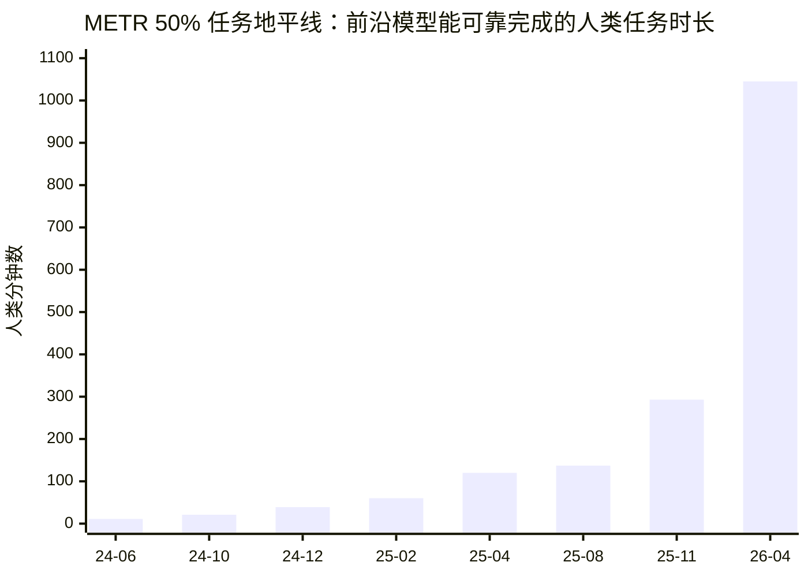
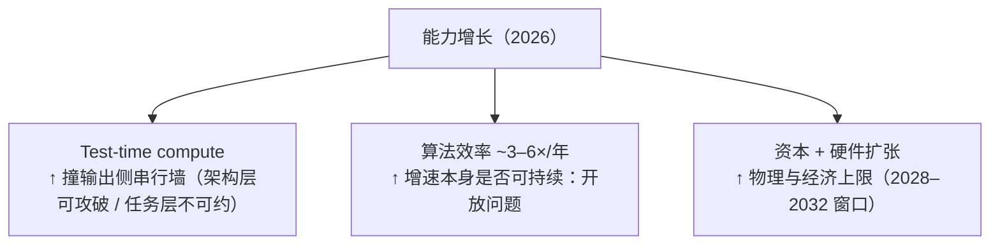

# 推理的墙与增长的引擎：2026 大模型技术快照

最近花了不少时间梳理大模型推理的成本结构和 2026 年的技术走向，把结论整理成这篇。核心问题有两个：

1. 大模型推理的**输入侧和输出侧**各自的瓶颈在哪里？2026 年有没有突破方向？
2. 抛开参数量的叙事，**2026 年的 AI 发展到底体现在什么地方**？

先给结论：输出侧（串行 decode）是当前真正的成本墙；架构层的串行在常数因子层面被蚕食但收益有限，严格链式依赖的任务层串行目前不可约。而 2026 年的能力增长已经不再靠"堆参数"，而是靠 test-time compute、训练配方和算法效率——这三条腿里，有两条各自撞着不同的墙。

---

## 一、推理成本解剖：输入侧 vs 输出侧

一次 LLM 推理分两个阶段，成本结构完全不同：

| | Prefill（输入侧） | Decode（输出侧） |
|---|---|---|
| 计算量 | attention 项 O(N²·d)，FFN 项 O(N·d²) | 每 token O((N+M)·d + d²_active)，随生成量 M 线性累积 |
| 并行性 | 可并行，墙钟时间可以很短 | **串行**，墙钟时间 ∝ M |
| KV cache | 前缀只算一次，后续只对新增 token 增量 prefill | 每步读全量 KV cache |

（N = 输入 token 数，M = 生成 token 数，d = 隐藏维度）

### 输入侧：平方项约束的是上下文长度，不是总成本

O(N²) 的 attention 是输入侧最著名的标签，但它咬人的场景很窄：**一次性灌入超大 fresh 上下文、无缓存复用**。在有 KV cache 的 agent 循环里，历史上下文只付一次 prefill 成本，输入侧有效成本近似随**新增** token 线性。再加上厂商对 cache read 的折扣定价（0.1–0.25×），输入侧在长程任务里通常不是账单大头。

所以输入侧的真实瓶颈是**上下文长度上限**（平方项 + KV 显存），而不是"推理总成本"。

### 输出侧：串行墙钟 + 带宽瓶颈，成本卡在这里

Decode 每个 token 依赖前一个，墙钟时间 ∝ M，这是硬约束。更具体地，decode 通常是 **memory-bandwidth bound**（每步要读 KV cache 和权重），不是 compute bound——堆算力也不线性提速。

这一点之所以关键，是因为 2024 年以来能力增长的主轴恰恰是 test-time compute（**测试时算力**，即推理时算力）：不再靠把模型训得更大，而是让同一个模型在回答问题时“想更久”——生成更长的推理链、采样多个候选再选优（best-of-N）、自我修正迭代。注意它和“效率”是反方向：训练效率是“同样能力花更少训练算力”，test-time compute 是“同样模型，推理时烧更多 token 换更强表现”。METR 的长程 agent 任务单次运行消耗 1 亿到 15 亿 token。**能力增长轴 = 输出 token 量 → 串行墙钟 + 带宽瓶颈**，成本和时间都线性涨在输出侧。这就是整面墙的位置。

---

## 二、2026 年的突破方向：按"打破程度"排序

### 1. Speculative decoding / MTP：已落地，常数因子

小模型（或同模型的 draft head）先猜几个 token，大模型并行验证。vLLM、TensorRT-LLM 都已生产部署。2026 年的代表工作 Orthrus 把 diffusion proposer 和 AR verifier 挂在同一个 KV cache 上，省掉独立的 draft cache。

定位很清楚：**改常数项（2–3×），不改渐近结构**。是好东西，但不是颠覆。

### 2. 线性 attention / SSM：解决带宽，不解决串行

Mamba-2、NVIDIA Griffin 这一系把 attention 换成状态空间模型：线性复杂度、常规模态显存、token 生成最高快 8×（NVIDIA NeMo 数据）。

但固定大小状态意味着把全部历史压进一个向量——需要精确召回长程信息时表达力不够，和当年 RNN 式微的原因类似。所以实用答案全是 **hybrid**（部分层 full attention + 部分层 SSM）。纯 SSM 在 frontier 没有站住。这条路线攻的是输入侧的 KV 带宽问题，对输出侧串行无能为力。

### 3. Diffusion LLM：最有希望的一条，还卡在 proof-of-concept

离散扩散语言模型（LLaDA、NVIDIA Dream、iLLaDA）换掉 next-token prediction 范式：一次生成一个 block，迭代去噪精化。工程侧进展很快——Fast-dLLM（ICLR 2026）在短任务（GSM8K/MBPP，512 token）上做到 11×–27× 吞吐、精度损失小；iLLaDA（2026-06）已把 8B 双向扩散模型训到 12T token。

**但关键反证来自 2026 年 2 月**：*Why Diffusion Language Models Struggle with Truly Parallel Decoding?* 测了 LLaDA-8B 和 Dream-7B，发现实用的快速 DLM 实际都收敛回从左到右的 AR-like 解码动态。诊断是：DLM 目标与训练数据的高度串行结构（标准语料 + 长 CoT 监督）**不匹配**——在串行数据上训练，就得到串行的解码器。作者的修复改的是数据和监督方式（多条独立推理轨迹 + 并行强制解码），且并行度越高收益越大。

这句话的分量比看起来重：**瓶颈不在 decoder，而在训练目标和 CoT 数据本身**。

### 4. 必须区分两层串行

- **架构层串行**（next-token 范式强制一次一个 token）：在常数因子层面被蚕食（speculative decoding、diffusion 解码），上限是常数到小量级加速比；
- **任务层串行**（推理第 3 步依赖第 2 步的结果）：对**严格串行依赖链**，没有任何架构能打破，没有 decoder 能在 step k-1 之前算出 step k。但真实 agent 任务是 DAG 而非单链，独立分支仍可并行、多条路径可推测执行——“不可约”只对链式依赖成立。

METR 那些长程 agent 任务恰恰是长依赖链。所以即使 diffusion 路线完全成熟，它打破的也只是"next-token 范式"——而且注意，LLaDA/Dream 的骨干仍然是 attention Transformer，被颠覆的是生成目标，不是架构本身。真正"反 Transformer"的东西，2026 年不存在。

---

## 三、2026 年的 AI 发展体现在哪里

### 参数已经退居次要变量

- **总参数量**还在涨（MoE 普遍化：DeepSeek V3 671B/37B active，Mistral Large 3 675B/41B），但已解耦于成本；
- **每 token 激活参数**基本停在 17–41B 区间——这才是决定推理成本的数；
- **闭源实验室已停止公布参数量**，行业共识是 "size is a weak proxy for capability"；
- 新指标 "**intelligence density**"（每 active B 的能力）开始取代总参数成为 headline。极端例子：ZAYA1-8B（总 8B / active 仅 760M）对标大得多的开源模型。

### 能力增长的实际分解

用 Epoch AI 的框架，有效算力 ≈ 三个乘数相乘：

落到"performance 提升靠什么"，按当前权重排序：

1. **Test-time compute**——2024 起的主能力轴；
2. **训练配方**（RL post-training、数据质量、curriculum）——"how you train matters as much as how big you build"；
3. **算法效率**（3–6×/年取自 Epoch AI 口径的上半区）——同时作用于训练和推理两侧，效果大量体现在 intelligence density 上；
4. **裸参数量**——不再是 binding variable。

成本侧的下降则是另一组：MoE、speculative decoding、蒸馏、硬件。ARC-AGI-1 单位成本从 o3 的 $4,500/task 降到 GPT-5.2 Pro 的 $11.64/task，一年 390×，就是这组合计的效果。

### 几个可以量化的锚点

METR 任务地平线（p50，人类专家完成同等任务所需时间）的实测轨迹：

（对应模型：Claude 3.5 Sonnet ×2 → o1 → Claude 3.7 Sonnet → o3 → GPT-5 → Claude Opus 4.5 → Claude Mythos Preview。线性坐标下的"曲棍球杆"形状。8 个点拟合约 3.5 个月翻倍（R²=0.98）；METR 2025-03 论文用 2019 年起全窗口给出的是约 7 个月，并注明 2024 年后可能加速——加速本身在这组数据里得到了印证。）

| 指标 | 数据 |
|---|---|
| METR 任务地平线 | 约 7 个月翻倍（2025-03 论文，2019 年起口径，2024 年后加速）；2024-06→2026-04 的 8 个实测点拟合约 3.5 个月 |
| 内部模型 vs 公开发布模型的差距 | METR 2026-05 Frontier Risk Report：四家实验室共享的内部 SOTA **没有显著强于**当时最强公开模型；Anthropic 自报发布 gap "通常不到一个月"，OpenAI "几周" |
| 长任务区间的测量置信度 | METR 自己标注 >16 小时的测量在当前任务集下不可靠，外推不确定性大 |

---

## 四、结语：一个更精确的增长模型

把前面两节合起来，2026 年的增长模式可以写成：

> 能力增长 = test-time compute（撞输出侧串行墙）+ 算法效率（增速本身是否可持续是开放问题）+ 资本/硬件扩张（有物理和经济上限）

这比"参数堆不动了"是一个更精确、也更值得警惕的版本：当前增长的两条主腿，一条撞物理墙，一条依赖未证明可持续的算法进步。架构层的突破（diffusion、speculative）能买回常数因子，买不回渐近结构；任务层的串行依赖目前没有任何已知方案。

2028–2032 常被当作外推中的 make-or-break 窗口来讨论：那之前靠芯片和电力的投入扩张还能撑住斜率，之后必须靠算法突破。（以上是外推判断，不是实测结论。）这个判断对不对，恰好可以用上面表格里那几个可量化指标逐年检验——这大概就是跟踪这个领域最诚实的方式。

---

## 参考来源

**推理架构与解码**

- [Why Diffusion Language Models Struggle with Truly Parallel (Non-Autoregressive) Decoding?](https://arxiv.org/abs/2602.23225)（2026-02）
- [Large Language Diffusion Models (LLaDA)](https://arxiv.org/abs/2502.09992)（2025-02）
- [Improved Large Language Diffusion Models (iLLaDA)](https://arxiv.org/abs/2606.25331)（2026-06）
- [Dream 7B: Diffusion Large Language Models](https://arxiv.org/abs/2508.15487)（2025-08）
- [Fast-dLLM: Training-free Acceleration of Diffusion LLM by Enabling KV Cache and Parallel Decoding](https://arxiv.org/abs/2505.22618)（ICLR 2026）
- [Fast-dLLM v2: Efficient Block-Diffusion LLM](https://arxiv.org/abs/2509.26328)（2025-09）
- [A Survey of Algorithms and Systems for Generation-Refinement (speculative decoding 分类学)](https://aclanthology.org/2025.findings-emnlp.716.pdf)（EMNLP 2025 Findings）
- [Orthrus: Memory-Efficient Parallel Token Generation via Dual-View Diffusion](https://arxiv.org/abs/2605.12825)（2026，经 [sesen.ai 综述](https://sesen.ai/blog/parallel-token-generation-diffusion-decoding) 引用）
- [NVIDIA NeMo: Hybrid State Space Model Support（Mamba-2 / Griffin，8× token 生成加速）](https://developer.nvidia.com/blog/nvidia-nemo-accelerates-llm-innovation-with-hybrid-state-space-model-support)
- [Awesome-Diffusion-LLM 论文列表](https://github.com/AIDASLab/Awesome-Diffusion-LLM)

**能力测量与增长**

- [METR: Task-Completion Time Horizons of Frontier AI Models](https://metr.org/time-horizons/)（含原始数据）
- [Measuring AI Ability to Complete Long Tasks](https://arxiv.org/abs/2503.14499)（METR, 2025-03）
- [METR Frontier Risk Report (February–March 2026)](https://metr.org/blog/2026-05-19-frontier-risk-report)
- [From AGI to ASI（Epoch AI，算力增长三因子分解）](https://arxiv.org/html/2606.12683v1)
- [The ARC of Progress towards AGI: A Living Survey](https://arxiv.org/html/2603.13372v1)（ARC-AGI 成本/效率数据）
- [80,000 Hours: What the hell happened with AGI timelines in 2025?](https://80000hours.substack.com/p/what-the-hell-happened-with-agi-timelines)（含 2026-02 更新）

**行业与模型规模**

- [BenchLM: Frontier AI Models Rankings (2026-09)](https://benchlm.ai/frontier-ai-models)
- [WhatLLM: New AI Models May 2026（intelligence density 指标）](https://whatllm.org/blog/new-ai-models-may-2026)
- [MLPlus: LLM Scaling Laws Dashboard (2026)](https://machinelearningplus.com/gen-ai/llm-scaling-laws-model-comparison)

*写作时间：2026 年 10 月。数据以各来源发布时间为准，前沿领域数字更新很快。*